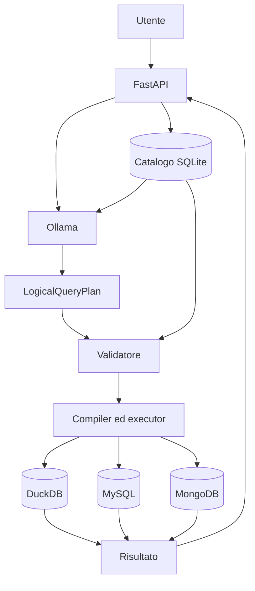

# QueryX

QueryX è un agente AI per data engineering che trasforma domande in linguaggio naturale in interrogazioni controllate su sorgenti dati eterogenee.

Supporta:

- file CSV e Parquet tramite DuckDB;
- database relazionali MySQL;
- database documentali MongoDB;
- modelli linguistici locali tramite Ollama.

L'LLM classifica la richiesta e propone un `LogicalQueryPlan`, ma non genera direttamente SQL o pipeline MongoDB eseguibili. Il piano viene validato rispetto al catalogo, compilato deterministicamente ed eseguito soltanto se rispetta i vincoli del sistema.

## Architettura



Il modello linguistico non accede direttamente ai database. Credenziali, nomi fisici, SQL e pipeline restano dettagli interni all'applicazione.

## Requisiti

- Git;
- Docker;
- Docker Compose;
- Ollama;
- almeno un modello installato localmente;
- `curl`;
- Python 3, utilizzato dagli script di supporto.

## Clonazione e configurazione

```bash
git clone https://github.com/pyxidious/queryX.git
cd queryX
cp .env.example .env
```

Scarica il modello Ollama configurato nel file `.env`:

```bash
ollama pull qwen3.5:9b
```

Il nome del modello deve corrispondere alla variabile:

```env
OLLAMA_MODEL=qwen3.5:9b
```

Con Docker, QueryX raggiunge Ollama sull'host tramite:

```env
OLLAMA_BASE_URL=http://host.docker.internal:11434
```

## Script di gestione

QueryX include script dedicati per avvio, arresto e riproduzione delle attività sperimentali.

Prima del primo utilizzo, rendili eseguibili:

```bash
chmod +x scripts/start-queryx.sh
chmod +x scripts/stop-queryx.sh
chmod +x scripts/reproduce.sh
```

## Avvio di QueryX

Lo script di avvio:

- verifica la presenza dei comandi necessari;
- avvia Ollama se non è già disponibile;
- costruisce e avvia i container Docker;
- attende che l'API QueryX sia pronta;
- mostra gli indirizzi delle interfacce principali;
- visualizza lo stato dei container.

```bash
./scripts/start-queryx.sh
```

Al termine dell'avvio saranno disponibili:

- Dashboard: `http://localhost:8000/ui`
- Interrogazione dati: `http://localhost:8000/ui/query`
- API OpenAPI: `http://localhost:8000/docs`

È possibile evitare l'avvio automatico di Ollama impostando:

```bash
START_OLLAMA=false ./scripts/start-queryx.sh
```

In questo caso Ollama deve essere già attivo sull'host.

## Arresto di QueryX

Per arrestare i container QueryX mantenendo i dati persistenti:

```bash
./scripts/stop-queryx.sh
```

Per arrestare anche un processo Ollama avviato dallo script QueryX:

```bash
STOP_OLLAMA=true ./scripts/stop-queryx.sh
```

Per rimuovere anche i volumi Docker:

```bash
REMOVE_VOLUMES=true ./scripts/stop-queryx.sh
```

> Attenzione: la rimozione dei volumi elimina catalogo, dati persistenti, ingestion e database dimostrativi. Questa opzione deve essere usata soltanto quando si desidera ricostruire completamente l'ambiente.

## Avvio manuale

In alternativa agli script:

```bash
ollama serve
docker compose up --build -d
```

Verifica dell'applicazione:

```bash
curl http://localhost:8000/health
```

## Dati dimostrativi

Con lo stack avviato:

```bash
docker compose exec queryx python -m queryx.tools.seed_demo
```

Il seed deterministico genera:

| Backend | Dati | Totale |
|---|---|---:|
| MySQL | customers | 10.000 |
| MySQL | orders | 100.000 |
| MongoDB | profiles | 10.000 |
| MongoDB | events | 100.000 |

Dopo il seed, aggiorna il catalogo:

```bash
curl -X POST http://localhost:8000/sources/mysql/scan
curl -X POST http://localhost:8000/sources/mongodb/scan
```

## Interrogazione in linguaggio naturale

Esempio tramite API:

```bash
curl -X POST http://localhost:8000/query/natural-language \
  -H 'Content-Type: application/json' \
  -d '{
    "question": "Quanti ordini ci sono per stato?",
    "execute": true
  }'
```

La stessa operazione può essere eseguita tramite l'interfaccia:

```text
http://localhost:8000/ui/query
```

## Riproduzione interattiva

Lo script:

```bash
./scripts/reproduce.sh
```

esegue inizialmente una fase di preflight che verifica:

- Docker;
- Docker Compose;
- Ollama;
- disponibilità del modello configurato;
- presenza del file `.env`;
- raggiungibilità dei servizi richiesti.

Successivamente permette di scegliere se effettuare il warm-up del modello Ollama.

Esempio:

```text
Ollama model warm-up
--------------------
The model can be loaded into memory before continuing.

Warm up Ollama model 'qwen3.5:9b' now? [Y/n]:
```

Il warm-up invia una richiesta preliminare al modello e lo mantiene caricato in memoria prima delle interrogazioni o del benchmark.

Dopo l'avvio dell'ambiente viene mostrato il menu:

```text
What do you want to run?
  1) Ask a single natural-language question
  2) Run the complete experimental benchmark
  3) Exit
```

### Domanda singola

Scegliendo l'opzione `1`, lo script richiede:

- la domanda in linguaggio naturale;
- se generare soltanto il piano;
- se eseguire anche il piano prodotto.

Esempio:

```text
Question: Quanti ordini ci sono nel database MySQL?
Execute the generated plan? [Y/n]: y
```

La risposta JSON viene formattata automaticamente tramite `jq`, quando disponibile.

### Benchmark completo

Scegliendo l'opzione `2`, lo script esegue:

1. generazione dei dati dimostrativi;
2. discovery e profiling della sorgente MySQL;
3. discovery e profiling della sorgente MongoDB;
4. generazione della ground truth;
5. conteggio e preparazione dei casi;
6. esecuzione completa del benchmark.

Durante le operazioni più lunghe viene mostrato un indicatore animato con il tempo trascorso.

Esempio:

```text
| Benchmark... elapsed: 04:18
```

Al termine vengono mostrati:

- etichetta del modello;
- numero di casi elaborati;
- directory dei risultati.

I risultati vengono salvati in:

```text
benchmark/results/
```

## Riproduzione tramite Makefile

La procedura interattiva può essere avviata anche con:

```bash
make reproduce
```

Per specificare l'etichetta del benchmark:

```bash
MODEL_LABEL=qwen3.5-9b-100k make reproduce
```

Sono inoltre disponibili i passaggi separati:

```bash
make up
make wait
make preflight
make seed
make scan
make ground-truth
make benchmark
make test
```

## Importazione di CSV e Parquet

Tramite API:

```bash
curl -X POST http://localhost:8000/ingestions/uploads \
  -F 'file=@./orders.csv' \
  -F 'logical_name=orders'
```

Tramite interfaccia web:

```text
http://localhost:8000/ui/ingestions/new
```

Flusso di ingestion:

```text
upload
→ staging
→ inspection
→ registrazione nel catalogo
→ normalizzazione Parquet
→ vista DuckDB
```

Non sono supportati:

- archivi ZIP;
- URL remoti;
- download automatici;
- upload multipli nella stessa richiesta.

## Esempio di ingestion dimostrativa

Per una demo è possibile utilizzare un piccolo file CSV:

```csv
order_id,customer_name,city,category,amount
1001,Anna Rossi,Milano,Elettronica,349.90
1002,Luca Bianchi,Roma,Casa,89.50
1003,Giulia Verdi,Torino,Libri,42.00
1004,Marco Neri,Napoli,Elettronica,599.00
1005,Sara Gallo,Bologna,Sport,125.75
```

Nome consigliato:

```text
demo_sales.csv
```

Nome logico:

```text
demo_sales
```

Dopo l'ingestion e la preparazione analytics, il dataset può essere interrogato dall'interfaccia QueryX.

Esempio:

```text
Qual è il totale degli importi nel dataset demo_sales?
```

## Test

Suite completa:

```bash
make test
```

Il comando esegue:

```bash
docker compose exec queryx pytest -q
```

Test specifici per seed e benchmark:

```bash
make test-reproduction
```

## API principali

| Metodo | Endpoint | Funzione |
|---|---|---|
| `GET` | `/health` | stato dell'applicazione |
| `GET` | `/sources` | elenco delle sorgenti |
| `POST` | `/sources/{source_id}/scan` | discovery e profiling |
| `GET` | `/catalog/current` | catalogo corrente |
| `POST` | `/ingestions/uploads` | upload CSV o Parquet |
| `POST` | `/query/validate` | validazione del piano |
| `POST` | `/query/execute` | esecuzione del piano |
| `POST` | `/query/natural-language` | interrogazione in linguaggio naturale |

## Struttura degli script

```text
scripts/
├── start-queryx.sh
├── stop-queryx.sh
└── reproduce.sh
```

### `start-queryx.sh`

Gestisce l'avvio dell'ambiente e l'attesa dei servizi.

### `stop-queryx.sh`

Arresta lo stack Docker e, opzionalmente, Ollama e i volumi.

### `reproduce.sh`

Gestisce:

- preflight;
- warm-up opzionale di Ollama;
- domanda singola;
- benchmark sperimentale;
- stato di avanzamento delle operazioni.

## Documentazione

- [Benchmark](benchmark/README.md)
- [Test](tests/README.md)
- [Architettura](docs/architecture.md)
- [API](docs/api.md)
- [Configurazione](docs/configuration.md)
- [Ingestion](docs/ingestion.md)

## Limiti attuali

- MySQL e MongoDB supportano piani single-source;
- le query federate tra backend non sono supportate;
- i join devono essere dichiarati nel catalogo;
- non è presente memoria conversazionale multi-turno;
- GraphDB non è ancora supportato.