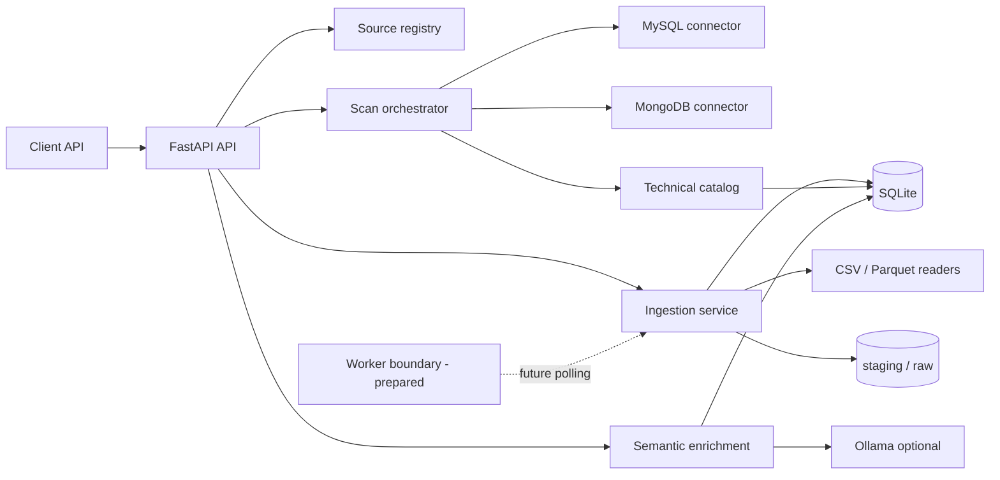
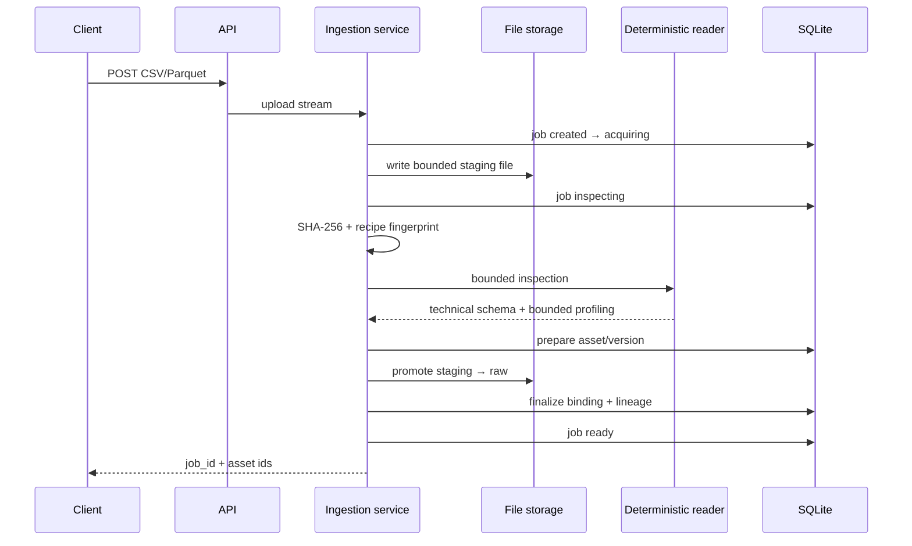

# QueryX

QueryX è un modular monolith Python/FastAPI per scoprire, catalogare e arricchire metadata di sorgenti dati e per acquisire dataset gestiti. La discovery tecnica è deterministica: connettori e reader osservano schema e metadata con budget limitati, mentre l'LLM opzionale interviene solo sull'arricchimento semantico.

## Stato dell'implementazione

Sono disponibili:

- source registry configurato per MySQL e MongoDB;
- health check, discovery dello schema e profiling limitato;
- catalogo tecnico persistente in SQLite, snapshot versionati, fingerprint e schema drift;
- gestione del catalogo `current`/`stale` quando una scansione fallisce;
- enrichment semantico opzionale tramite Ollama, persistito separatamente;
- upload locale CSV e Parquet, staging sicuro, SHA-256 e inspection deterministica limitata;
- job di ingestion persistenti e asset stabili con versioni incrementali, storage binding e lineage di upload;
- retry idempotenti per asset target, segnalazione dei contenuti duplicati e drift tra versioni;
- preview on demand dal file raw e reconciliation invocabile dal service layer;
- API per stato job, preview limitata e consultazione degli asset;
- test automatici offline.

L'ingestion termina oggi nello stato `ready`: il file è stato validato, ispezionato e promosso in `raw`, e sono stati creati asset/versione/binding. Normalizzazione e caricamento in un backend analitico non sono ancora implementati, quindi il job non viene dichiarato `completed`.

## Concetti principali

| Concetto | Significato |
|---|---|
| External source | Database già esistente, posseduto fuori da QueryX, che viene connesso e scansionato senza acquisirne i dati. |
| Managed dataset | Dataset acquisito da QueryX tramite ingestion, con file controllato, job e lineage. |
| Data asset | Identità logica stabile del dataset. Nuovi upload possono aggiungere versioni senza cambiare l'`asset_id`. |
| Asset version | Versione immutabile dell'asset, legata ai fingerprint di sorgente, schema e recipe. |
| Storage binding | Associazione tra una versione e una collocazione fisica. Oggi il backend è `file`; i valori validati preparano DuckDB, SQL, MongoDB e GraphDB futuri. |

Una sorgente esterna non è un dataset importato. Analogamente, origine, versione del file, schema tecnico, annotazioni semantiche e storage fisico rimangono concetti e record separati.

Senza `asset_id` un upload crea un nuovo asset e la versione 1. Passando un `asset_id` valido viene allocato, dentro una transazione SQLite `BEGIN IMMEDIATE`, il numero successivo univoco. Fingerprint, recipe e schema di una versione pronta non vengono riscritti.

Idempotenza e duplicazione hanno semantiche diverse:

- stesso file, stessa recipe e stesso asset target: QueryX riusa la versione pronta compatibile;
- stesso asset ma file o recipe differenti: viene creata la versione successiva;
- stesso contenuto su asset differenti: gli asset restano separati e il nuovo job riceve un warning `duplicate_content` con i match trovati.

## Architettura

Il progetto è un modular monolith: un unico deploy applicativo contiene moduli con responsabilità separate e comunica con SQLite attraverso storage espliciti. Questo mantiene semplice l'operatività attuale senza impedire di estrarre in futuro ingestion worker o adapter di materializzazione.



Componenti:

- **API**: espone health, source registry, catalogo, enrichment, ingestion e asset;
- **source registry**: costruisce le sorgenti configurate senza persistere credenziali nel catalogo;
- **connectors**: estraggono metadata da MySQL e MongoDB entro budget configurati;
- **catalog**: salva scansioni, snapshot, fingerprint, drift e stato current/stale;
- **ingestion**: valida upload, scrive staging, calcola hash, esegue inspection e crea asset;
- **semantic enrichment**: produce annotazioni opzionali senza modificare i metadata tecnici;
- **worker boundary**: storage e service permettono di spostare l'orchestrazione dietro polling SQLite; in questa fase non è avviato un worker separato;
- **SQLite**: persiste catalogo, job, asset, versioni, binding e lineage, mai i file binari;
- **Ollama**: dipendenza opzionale usata soltanto per metadata semantici.

### Flusso delle sorgenti esterne

```text
connessione → discovery → profiling limitato → fingerprint → catalogo → drift → enrichment opzionale
```

La discovery MySQL legge metadata dichiarati. MongoDB combina metadata dichiarati e inferenza deterministica su un campione limitato. Un errore di scansione non cancella l'ultimo snapshot valido: la sorgente viene esposta come `stale`.

### Flusso di ingestion



Il nome ricevuto dal client viene validato ma non diventa mai un percorso: QueryX genera un identificatore interno. La scrittura è limitata per byte, usa creazione esclusiva, non sovrascrive file e rimuove gli artefatti incompleti in caso di errore. I percorsi restituiti e persistiti sono riferimenti relativi controllati, non path assoluti.

CSV viene letto come UTF-8, con intestazioni obbligatorie e un campione limitato per l'inferenza dei tipi. Il conteggio è limitato e viene marcato come stimato quando il limite è raggiunto. Parquet usa footer e schema nativi tramite PyArrow; non avviene alcuna conversione.

Le nuove ingestion non persistono righe di preview in SQLite. `GET /ingestions/{job_id}/preview` risolve il binding controllato e legge al massimo il limite configurato direttamente dal file raw. I vecchi job che contengono già una preview persistita restano leggibili come fallback di compatibilità.

### Drift tra versioni

Il `catalog_adapter` converte ogni inspection in metadata tecnici neutrali. Quando esiste una versione pronta precedente dello stesso asset, QueryX salva un diff deterministico con campi aggiunti/rimossi, cambi di tipo e cambi di nullability. Il confronto non usa Ollama. Il diff della prima versione ha `has_drift=false` perché non esiste una baseline precedente.

### Consistenza e recovery

Filesystem e SQLite non possono partecipare a una singola transazione atomica. QueryX usa quindi una piccola saga locale:

1. acquisizione in staging e inspection;
2. registrazione della versione `preparing` in SQLite;
3. promozione non sovrascrivente in raw;
4. creazione transazionale di binding e lineage e passaggio a `ready`.

Se la promozione fallisce non viene creato alcun binding pronto. Se la finalizzazione DB fallisce, il raw appena creato dal job viene rimosso quando è sicuramente di sua proprietà e la versione preparatoria diventa `failed`.

`IngestionService.reconcile()` individua job `acquiring`/`inspecting` più vecchi della policy configurata, binding con file mancanti, staging orfani e raw non referenziati. Una versione `preparing` viene completata solo se staging o raw esistono e il SHA-256 coincide; altrimenti il job diventa `failed`. Gli staging orfani vengono rimossi, mentre i raw non referenziati vengono soltanto segnalati per evitare cancellazioni distruttive.

## Schema tecnico e metadata semantici

L'LLM non inferisce lo schema tecnico perché il risultato deve essere riproducibile, verificabile e adatto a fingerprint e drift. Tipi, colonne, nullability e metadata del formato provengono esclusivamente da connettori e reader deterministici.

Le annotazioni semantiche (descrizioni, sinonimi, business term e sensitivity suggerita) sono archiviate in tabelle distinte e collegate al fingerprint tecnico. Se lo schema cambia, l'arricchimento precedente può diventare `stale`; non viene incorporato né riscritto nello snapshot tecnico. Le righe di preview non vengono inviate a Ollama e non vengono loggate.

## Avvio dello stack

Requisiti: Docker con Compose v2. Ollama è opzionale e gira sull'host.

```bash
cp .env.example .env
docker compose up --build
```

L'API è disponibile su `http://localhost:8000`. Compose avvia API, MySQL demo e MongoDB demo. Il volume `queryx_catalog` monta `/app/data`, includendo SQLite e le directory di ingestion. Non esiste ancora un servizio `queryx-worker`: l'inspection limitata dei piccoli upload viene eseguita sincronicamente dietro il service layer.

Per sviluppo locale:

```bash
python -m venv .venv
.venv/bin/pip install -e '.[dev]'
.venv/bin/uvicorn queryx.app.main:app --reload
```

## Test

La suite non richiede Internet, GPU, Ollama reale o database esterni:

```bash
.venv/bin/pytest -q
```

## API ed esempi

Endpoint principali già presenti:

- `GET /health`, `GET /llm/health`;
- `GET /sources`, `GET /sources/{source_id}`;
- `POST /sources/{source_id}/scan`, `POST /catalog/scan`;
- `GET /catalog/latest`, `GET /catalog/current` e API history/diff/semantic;
- `POST /ingestions/uploads`;
- `GET /ingestions/{job_id}` e `GET /ingestions/{job_id}/preview`;
- `GET /assets` e `GET /assets/{asset_id}`;
- `GET /assets/{asset_id}/versions` e `GET /assets/{asset_id}/versions/{version_id}`;
- `GET /assets/{asset_id}/diff` e `GET /assets/{asset_id}/versions/{version_id}/diff`.

Upload CSV:

```bash
curl -sS -X POST http://localhost:8000/ingestions/uploads \
  -F 'file=@./customers.csv;type=text/csv'
```

Upload Parquet:

```bash
curl -sS -X POST http://localhost:8000/ingestions/uploads \
  -F 'file=@./events.parquet;type=application/vnd.apache.parquet'
```

Nuova versione di un asset esistente:

```bash
curl -sS -X POST http://localhost:8000/ingestions/uploads \
  -F 'asset_id=ASSET_ID' \
  -F 'file=@./customers-v2.csv;type=text/csv'
```

Con il `job_id` restituito:

```bash
curl -sS http://localhost:8000/ingestions/JOB_ID
curl -sS http://localhost:8000/ingestions/JOB_ID/preview
curl -sS http://localhost:8000/assets
curl -sS http://localhost:8000/assets/ASSET_ID
curl -sS http://localhost:8000/assets/ASSET_ID/versions
curl -sS http://localhost:8000/assets/ASSET_ID/versions/VERSION_ID
curl -sS http://localhost:8000/assets/ASSET_ID/diff
curl -sS http://localhost:8000/assets/ASSET_ID/versions/VERSION_ID/diff
```

Gli errori hanno forma strutturata, per esempio `detail.error.code` e `detail.error.message`; non includono stack trace o percorsi assoluti.

## Directory dati

```text
data/
├── queryx_catalog.sqlite3  # catalogo e stato applicativo
├── staging/                # file temporanei durante acquisition/inspection
├── raw/                    # upload validati, immutati
└── normalized/             # predisposta, non ancora popolata
```

I file sono nel filesystem/volume, non in SQLite. `data/` è esclusa dal repository Git e dal build context Docker.

## Configurazione ingestion

| Variabile | Default container | Uso |
|---|---:|---|
| `DATA_RAW_DIR` | `/app/data/raw` | File validati promossi da staging. |
| `DATA_STAGING_DIR` | `/app/data/staging` | Scrittura temporanea controllata. |
| `DATA_NORMALIZED_DIR` | `/app/data/normalized` | Directory riservata alla normalizzazione futura. |
| `INGESTION_MAX_UPLOAD_BYTES` | `26214400` | Dimensione massima, verificata durante lo streaming. |
| `INGESTION_PREVIEW_ROWS` | `10` | Massimo righe lette on demand dal raw e restituite per preview. |
| `INGESTION_INSPECTION_ROWS` | `100` | Campione massimo per inferenza CSV. |
| `INGESTION_CSV_COUNT_ROWS` | `10000` | Limite del conteggio righe CSV. |
| `INGESTION_STALE_JOB_SECONDS` | `300` | Età dopo la quale reconciliation considera interrotto un job attivo. |

Le altre variabili in `.env.example` configurano sorgenti, budget di profiling, SQLite e Ollama. Non inserire credenziali reali nel repository.

## Limiti attuali

- un solo processo API; ingestion sincrona e limitata, adatta soltanto a file piccoli entro il limite configurato;
- reconciliation disponibile soltanto tramite service layer: nessun polling automatico e nessun worker Compose;
- nessuna fusione o deduplicazione fisica automatica tra asset differenti;
- nessuna normalizzazione o materializzazione; `normalized/` resta vuota;
- CSV supporta UTF-8 e schema inferito su campione, senza policy avanzate per locale o encoding;
- nessuna UI di importazione, Kaggle, DuckDB o GraphDB;
- nessuna query generation.

## Roadmap

Funzionalità pianificate, **non ancora implementate**:

1. normalizzazione canonica in Parquet e recipe versionate;
2. catalogo/materializzazione analitica in DuckDB;
3. acquisizione Kaggle dietro un source adapter;
4. UI server-rendered per upload, stato e preview;
5. worker single-process con claim atomico e polling SQLite;
6. materializzazione controllata in MySQL e MongoDB;
7. storage e lineage GraphDB;
8. logical query plan indipendente dai backend;
9. compilatori SQL, MQL e Cypher.
