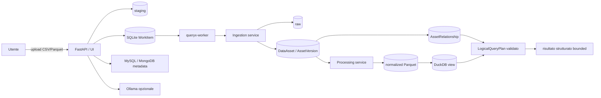

# QueryX

QueryX è un modular monolith Python/FastAPI per trasformare domande in linguaggio naturale in interrogazioni controllate su repository dati, validare i risultati e produrre risposte spiegate. La discovery tecnica è deterministica; Ollama è opzionale e viene usato soltanto per l’arricchimento semantico.

## Funzionalità disponibili

- registry e discovery per MySQL e MongoDB;
- catalogo tecnico SQLite con snapshot, fingerprint e schema drift;
- enrichment semantico opzionale, persistito separatamente;
- importazione manuale di un singolo file CSV o Parquet;
- staging sicuro, inspection limitata, SHA-256 e job persistenti;
- `DataAsset`, `AssetVersion`, storage binding e lineage;
- normalizzazione canonica Parquet tramite PyArrow;
- viste persistenti DuckDB e preview limitate;
- relazioni dichiarate tra asset e query logiche deterministiche bounded;
- coda SQLite con claim atomico, lease, heartbeat, retry e cancellazione;
- API FastAPI e UI Jinja offline con CSRF e autoescape.

QueryX non comunica direttamente con Kaggle e non effettua download, ricerca dataset, URL fetching o estrazione ZIP. Un dataset può essere stato scaricato manualmente da Kaggle o da qualunque altra fonte: l’utente deve estrarlo localmente e caricare uno dei file CSV o Parquet.

## Architettura

API e worker usano la stessa immagine e gli stessi service applicativi, ma sono processi distinti. SQLite ospita catalogo e coda; non è richiesto un broker esterno.



Il flusso ufficiale dei dataset gestiti è:

```text
download ed estrazione eseguiti dall’utente
→ upload manuale CSV/Parquet
→ staging
→ IngestionJob
→ raw
→ DataAsset/AssetVersion
→ normalizzazione Parquet
→ DuckDB
```

Ogni file produce un `IngestionJob` indipendente. Non sono supportati ZIP, upload multipli, URL o provider esterni.

## Importazione manuale

Apri `http://localhost:8000/ui/ingestions/new`, scegli un file CSV o Parquet e, facoltativamente, un nome logico o un asset esistente. Se la sorgente distribuisce un archivio, estrailo prima sul computer:

```bash
unzip dataset.zip -d dataset
```

Poi carica un singolo `.csv` o `.parquet`. Il filename ricevuto viene validato ma non viene mai usato come path; QueryX genera nomi fisici interni.

Esempio minimo:

```bash
curl -X POST http://localhost:8000/ingestions/uploads \
  -F 'file=@./orders.csv' \
  -F 'logical_name=orders'
```

Per aggiungere una versione a un asset esistente:

```bash
curl -X POST http://localhost:8000/ingestions/uploads \
  -F 'file=@./orders-v2.parquet' \
  -F 'logical_name=orders' \
  -F 'asset_id=<asset-id>'
```

## Provenienza dichiarata

L’upload accetta metadata opzionali strutturati:

| Campo multipart | Limite | Significato |
|---|---:|---|
| `source_provider` | enum | `manual` (default), `kaggle`, `other` |
| `source_reference` | 512 | riferimento descrittivo o slug |
| `source_version` | 128 | versione dichiarata |
| `dataset_title` | 256 | titolo dichiarato |
| `license_name` | 128 | licenza dichiarata |
| `provenance_notes` | 1000 | note descrittive |

Gli spazi vengono normalizzati e l’HTML viene rifiutato. `source_reference` non è un path né un URL operativo: non viene aperto, risolto o reso automaticamente cliccabile. QueryX non verifica e non certifica la licenza. I campi liberi non vengono inviati automaticamente a Ollama e non devono essere inseriti nei log applicativi.

Esempio di dataset scaricato ed estratto manualmente da Kaggle:

```bash
curl -X POST http://localhost:8000/ingestions/uploads \
  -F 'file=@./olist_orders_dataset.csv' \
  -F 'logical_name=orders' \
  -F 'source_provider=kaggle' \
  -F 'source_reference=olistbr/brazilian-ecommerce' \
  -F 'source_version=latest-downloaded-manually' \
  -F 'dataset_title=Brazilian E-Commerce Public Dataset by Olist' \
  -F 'license_name=CC BY-NC-SA 4.0'
```

La provenance è metadata descrittivo dell’origine dichiarata. I metadata tecnici derivano invece dall’inspection deterministica del file. La provenance:

- è persistita sull’`IngestionJob` e nel metadata JSON del lineage;
- è esposta sul job e sull’`AssetVersion`;
- non entra nel content fingerprint, schema fingerprint o recipe fingerprint;
- non modifica inspection, `observed_schema`, `canonical_schema` o `serving_schema`;
- non causa nuove versioni: un contenuto idempotente può riusare la stessa versione;
- genera un nuovo edge soltanto quando la dichiarazione è realmente diversa.

## API principali

- `GET /health`
- `GET /worker/status`
- `GET /sources`
- `POST /sources/{source_id}/scan`
- `GET /catalog/current`
- `POST /ingestions/uploads`
- `GET /ingestions/{job_id}`
- `GET /ingestions/{job_id}/preview`
- `POST /ingestions/{job_id}/cancel`
- `GET /assets`
- `GET /assets/{asset_id}`
- `GET /assets/{asset_id}/versions/{version_id}`
- `POST /assets/{asset_id}/versions/{version_id}/prepare`
- `POST /relationships`, `GET /relationships`, `GET /relationships/{id}`
- `DELETE /relationships/{id}`
- `POST /query/validate`
- `POST /query/execute`
- `POST /query/natural-language`

I campi JSON preesistenti restano invariati; `provenance` è additivo nelle risposte di job e versione.

## Ingestion e processing

CSV richiede UTF-8 e intestazioni. L’inferenza del tipo usa un campione limitato; il conteggio può essere stimato. Poiché un campione non può dimostrare l’assenza di null nell’intero file, la nullability dei CSV inferiti è conservativa (`nullable=true`): i campi vuoti sono trattati come null durante inspection e normalizzazione. La policy strict continua a rifiutare valori non vuoti incompatibili con il tipo inferito, overflow e strutture non valide. Parquet conserva invece tipi e nullability dichiarati nel footer. Le preview vengono lette on demand dai binding controllati e non espongono path fisici.

L’ingestion termina in `ready`, quando raw, asset e versione sono validi. Il processing è separato: applica `canonical-parquet-v1`, scrive un Parquet normalizzato, registra una vista DuckDB e valida schema e output. `observed_schema`, `canonical_schema` e `serving_schema` rimangono distinti.

Idempotenza:

- stesso contenuto, recipe e asset target: riuso della versione pronta;
- contenuto o recipe differenti sullo stesso asset: nuova versione;
- stesso contenuto su asset diversi: asset separati e warning di duplicazione;
- stessa provenance sul riuso: nessun lineage equivalente duplicato;
- provenance diversa sul riuso: edge descrittivo aggiuntivo.

## Relazioni e query deterministiche

`AssetRelationship` descrive un join ammesso tra due `DataAsset`: campi sinistro e destro, cardinalità, join predefinito (`inner` o `left`), origine e stato. In questa milestone le relazioni sono soltanto dichiarate manualmente; QueryX verifica che gli asset e i campi esistano nell'`observed_schema` corrente e impedisce duplicati attivi equivalenti. `DELETE /relationships/{id}` disabilita il record senza cancellarlo.

Esempio:

```bash
curl -X POST http://localhost:8000/relationships \
  -H 'Content-Type: application/json' \
  -d '{
    "name": "orders-products",
    "left_asset_id": "<order-items-asset-id>",
    "left_field": "product_id",
    "right_asset_id": "<products-asset-id>",
    "right_field": "product_id",
    "relationship_type": "many_to_one",
    "join_type_default": "inner"
  }'
```

Il `LogicalQueryPlan` contiene esclusivamente sorgenti catalogate, join tramite relationship ID, proiezioni, filtri, aggregazioni, group by, ordinamento e limite. Il client non invia SQL, nomi di viste DuckDB o path. La validazione risolve una versione `ready`, il relativo serving binding DuckDB `ready`, gli schemi e le relazioni attive. Controlla inoltre alias, tipi, aggregazioni, group by e limite.

Esempio “numero ordini per stato”:

```json
{
  "sources": [{"alias": "o", "asset_id": "<orders-asset-id>"}],
  "projections": [
    {"source_alias": "o", "field": "order_status", "alias": "status"}
  ],
  "aggregations": [
    {"function": "count", "source_alias": "o", "field": "order_id", "alias": "orders"}
  ],
  "group_by": [{"source_alias": "o", "field": "order_status"}],
  "order_by": [{"field": "orders", "direction": "desc"}],
  "limit": 100
}
```

Per raggruppare temporalmente è disponibile la sola trasformazione controllata `date_trunc_month`, applicabile a campi date/timestamp nelle proiezioni e nel corrispondente `group_by`. I join usano sempre un `relationship_id` dichiarato; i casi orders/customer, orders/order_items e products/order_items non sono hardcoded e vanno registrati con gli ID reali del catalogo.

`POST /query/validate` normalizza il limite e restituisce lo schema di output previsto senza eseguire. `POST /query/execute` compila internamente una sola `SELECT` DuckDB con identificatori quoted, valori parametrizzati e `LIMIT`, quindi restituisce colonne, righe bounded, conteggio, indicazione di troncamento, tempo, fingerprint e warning. Il piano logico è quindi il contratto pubblico; il SQL fisico resta un dettaglio interno e non compare nelle risposte standard.

Ogni esecuzione crea un `QueryRun` di audit con piano normalizzato, fingerprint, versioni sorgente, stato e metriche. Le righe del risultato e il SQL completo non vengono persistiti; i valori dei filtri non vengono loggati. Timeout, limite predefinito e massimo sono configurati con `QUERY_TIMEOUT_SECONDS`, `QUERY_DEFAULT_LIMIT` e `QUERY_MAX_LIMIT`. La UI temporanea `/ui/query` accetta JSON e offre Validate/Execute; `/ui/relationships` permette di elencare e dichiarare relazioni.

## Linguaggio naturale → piano logico

`POST /query/natural-language` usa Ollama esclusivamente per produrre un candidato `LogicalQueryPlan`. Il prompt è limitato agli asset rilevanti che hanno versione e serving binding `ready`, ai relativi campi/tipi, alle relazioni attive e allo schema JSON del piano. Non contiene righe campione, path fisici, nomi di relation DuckDB o query fisiche.

```bash
curl -X POST http://localhost:8000/query/natural-language \
  -H 'Content-Type: application/json' \
  -d '{"question":"Quanti ordini ci sono per stato?","execute":false}'
```

La risposta contiene `normalized_plan`, `output_schema`, `warnings` e il tempo di planning; con `execute=true` contiene anche il risultato bounded, una breve `answer` opzionale e i tempi separati di execution ed explanation. La spiegazione usa soltanto domanda, colonne e un massimo di 10 righe del risultato, non riceve dettagli fisici o ragionamenti, segnala risultati vuoti o troncati e non può rendere fallita una query già completata. Ollama usa temperatura zero e le configurazioni esistenti per modello, timeout e context window. È ammesso un solo retry complessivo per il planning: per correggere JSON non valido oppure un piano semanticamente rifiutato. Nel secondo caso il modello riceve il piano precedente e il solo codice di validazione; il piano corretto passa nuovamente dal validatore deterministico prima di qualsiasi esecuzione.

Il modello non è un'autorità: il JSON viene parsato con modelli strict e passa sempre dal validatore deterministico esistente. Solo un piano valido può raggiungere il normale `QueryService`; compiler ed executor non ricevono testo libero. Input che tenta di fornire query fisiche viene rifiutato. Gli errori applicativi sono `llm_unavailable`, `llm_timeout`, `invalid_llm_json`, `invalid_logical_plan` e `ambiguous_question`.

Nella pagina `/ui/query` sono disponibili “Genera piano” e “Genera ed esegui”. Il piano prodotto resta visibile nell'editor JSON e il risultato riusa la stessa tabella bounded dell'esecuzione manuale.

## Worker

Il worker gestisce esclusivamente ingestion e processing. Il claim usa `BEGIN IMMEDIATE`; lease, heartbeat, backoff, retry limitati, cancellazione cooperativa e reconciliation restano separati dallo stato del dominio.

```bash
python -m queryx.app.worker
```

In modalità `worker`, l’API accoda e restituisce `202`; in modalità `inline`, utile per sviluppo e test, esegue nello stesso processo.

## Avvio

Requisiti: Docker con Compose oppure Python 3.12.

```bash
cp .env.example .env
docker compose up --build
```

Compose definisce `queryx`, `queryx-worker`, `mysql` e `mongodb`. API e worker condividono l’immagine e il volume `/app/data`. Non servono credenziali o secret per fonti di dataset.

Avvio locale:

```bash
python -m venv .venv
source .venv/bin/activate
pip install -e '.[dev]'
uvicorn queryx.app.main:app --reload
```

## Configurazione essenziale

La configurazione è documentata in `.env.example`. Le aree principali sono:

- MySQL e MongoDB (`MYSQL_*`, `MONGODB_*`);
- storage (`CATALOG_DB_PATH`, `DATA_RAW_DIR`, `DATA_STAGING_DIR`, `DATA_NORMALIZED_DIR`);
- ingestion e processing (`INGESTION_*`, `PARQUET_*`, `DUCKDB_*`);
- query bounded (`QUERY_DEFAULT_LIMIT`, `QUERY_MAX_LIMIT`, `QUERY_TIMEOUT_SECONDS`);
- worker (`QUERYX_EXECUTION_MODE`, `WORKER_*`);
- UI (`QUERYX_UI_*`);
- enrichment semantico (`OLLAMA_*`, `QUERYX_ENRICHMENT_*`).

## Compatibilità SQLite legacy

L’inizializzazione applica soltanto modifiche additive e idempotenti. Cataloghi creati da versioni precedenti possono contenere le tabelle legacy `acquisition_runs`, `acquisition_files`, relativi indici o colonne. Il codice corrente non li legge, non li scrive, non li mostra e non tenta di eliminarli.

Queste tabelle possono essere eliminate soltanto ricreando volontariamente il catalogo. L’aggiornamento non cancella asset, job, binding, lineage, raw o normalized esistenti.

## Sicurezza e limiti correnti

- soli CSV e Parquet, un file per richiesta;
- limite upload configurabile, default 25 MiB;
- nessun ZIP o estrazione server-side;
- nessun download, URL fetching o richiesta browser esterna;
- niente autenticazione/autorizzazione applicativa integrata;
- CSRF HMAC double-submit per POST UI, autoescape Jinja e asset locali;
- nessun SQL arbitrario, DDL/DML, subquery o funzione non prevista dal piano;
- query sempre bounded (default 100, massimo 1000) e timeout default 10 secondi;
- SQLite e worker singolo sono adatti allo stadio corrente, non a un cluster distribuito;
- la licenza è una dichiarazione dell’utente, non una valutazione legale;
- GraphDB non è ancora supportato.

## Test e verifiche

La suite è offline:

```bash
pytest -q
python -m compileall -q queryx tests
docker compose config --quiet
git diff --check
```

## Roadmap

1. richiesta interattiva di chiarimento per domande ambigue;
2. spiegazione del risultato;
3. benchmark tra modelli;
4. test di robustezza, consistenza e incertezza;
5. GraphDB.
