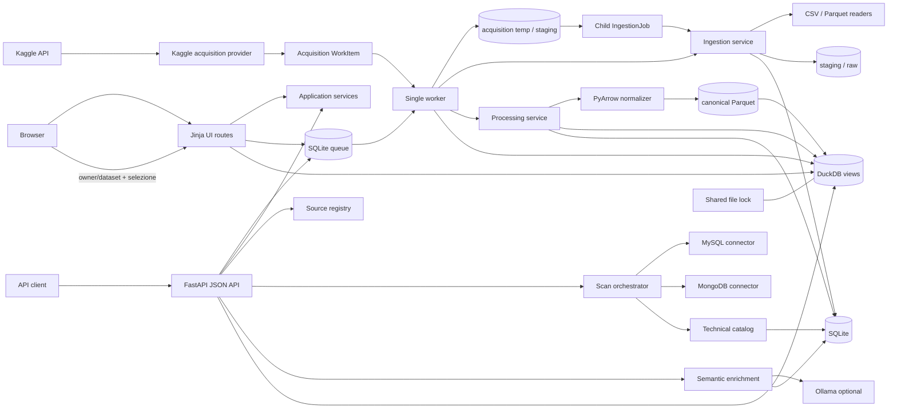
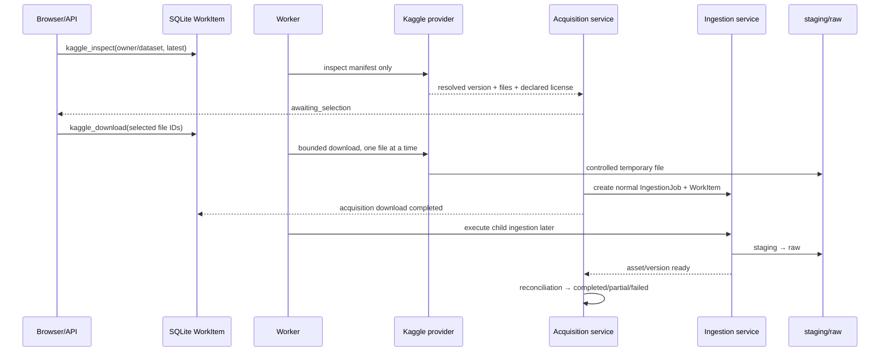
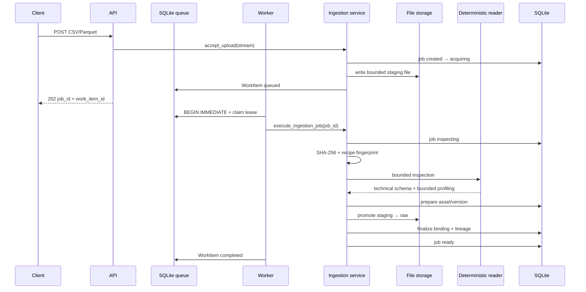
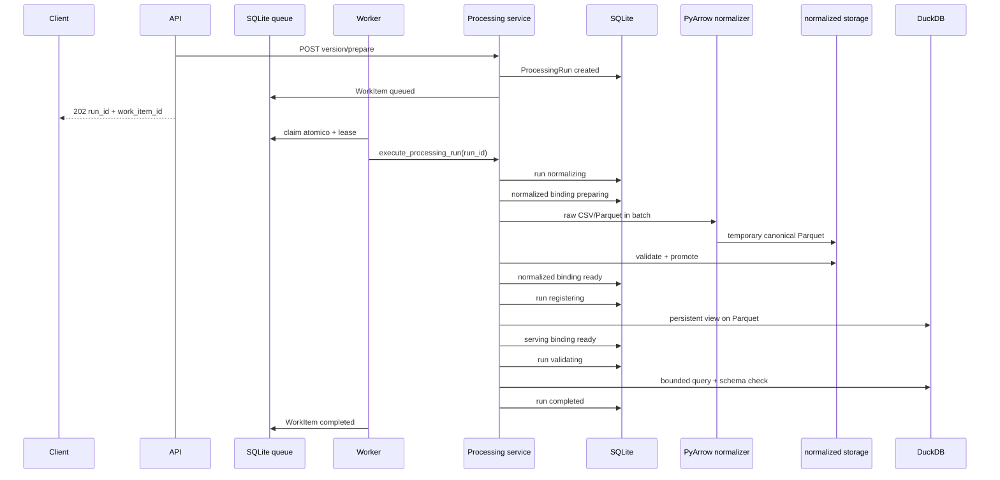

# QueryX

QueryX è un modular monolith Python/FastAPI per scoprire, catalogare e arricchire metadata di sorgenti dati e per acquisire dataset gestiti. La discovery tecnica è deterministica: connettori e reader osservano schema e metadata con budget limitati, mentre l'LLM opzionale interviene solo sull'arricchimento semantico.

## Stato dell'implementazione

Sono disponibili:

- source registry configurato per MySQL e MongoDB;
- health check, discovery dello schema e profiling limitato;
- catalogo tecnico persistente in SQLite, snapshot versionati, fingerprint e schema drift;
- gestione del catalogo `current`/`stale` quando una scansione fallisce;
- enrichment semantico opzionale tramite Ollama, persistito separatamente;
- upload locale CSV e Parquet, staging sicuro, SHA-256 e inspection deterministica limitata;
- job di ingestion persistenti e asset stabili con versioni incrementali, storage binding e lineage di upload;
- retry idempotenti per asset target, segnalazione dei contenuti duplicati e drift tra versioni;
- preview on demand dal file raw e reconciliation invocabile dal service layer;
- normalizzazione deterministica CSV/Parquet in Parquet canonico tramite PyArrow;
- serving analitico tramite viste persistenti DuckDB sui file normalized;
- ProcessingRun persistenti, retry partial e reconciliation degli output fisici;
- coda SQLite persistente con WorkItem, claim atomico, lease, heartbeat e retry limitati;
- worker single-process separato dall'API, avviato automaticamente da Docker Compose;
- coordinamento DuckDB cross-process tramite file lock nel volume dati;
- API per stato job, preview limitata e consultazione degli asset;
- UI server-rendered offline per dashboard, upload, polling, asset, versioni, binding, drift e preview;
- acquisition provider Kaggle con inspection del manifest, selezione esplicita e dispatch asincrono verso ingestion;
- test automatici offline.

L'ingestion termina nello stato `ready`: il raw e la versione logica sono pronti. La preparazione analitica è un flusso separato; il relativo `ProcessingRun` diventa `completed` soltanto quando Parquet normalizzato e vista DuckDB sono entrambi pronti e validati.

## Concetti principali

| Concetto | Significato |
|---|---|
| External source | Database già esistente, posseduto fuori da QueryX, che viene connesso e scansionato senza acquisirne i dati. |
| Managed dataset | Dataset acquisito da QueryX tramite ingestion, con file controllato, job e lineage. |
| Data asset | Identità logica stabile del dataset. Nuovi upload possono aggiungere versioni senza cambiare l'`asset_id`. |
| Asset version | Versione immutabile dell'asset, legata ai fingerprint di sorgente, schema e recipe. |
| Storage binding | Rappresentazione fisica della stessa AssetVersion: `raw/file`, `normalized/file` oppure `serving/duckdb`. |
| Processing run | Esecuzione versionata della recipe che produce normalized e serving binding senza creare una nuova AssetVersion. |
| Work item | Stato operativo della consegna al worker; è separato dallo stato di dominio di IngestionJob e ProcessingRun. |

Una sorgente esterna non è un dataset importato. Analogamente, origine, versione del file, schema tecnico, annotazioni semantiche e storage fisico rimangono concetti e record separati.

Senza `asset_id` un upload crea un nuovo asset e la versione 1. Passando un `asset_id` valido viene allocato, dentro una transazione SQLite `BEGIN IMMEDIATE`, il numero successivo univoco. Fingerprint, recipe e schema di una versione pronta non vengono riscritti.

Idempotenza e duplicazione hanno semantiche diverse:

- stesso file, stessa recipe e stesso asset target: QueryX riusa la versione pronta compatibile;
- stesso asset ma file o recipe differenti: viene creata la versione successiva;
- stesso contenuto su asset differenti: gli asset restano separati e il nuovo job riceve un warning `duplicate_content` con i match trovati.

## Architettura

Il progetto è un modular monolith: API e worker usano la stessa immagine e gli stessi moduli di dominio, ma sono processi distinti. SQLite è anche la coda persistente; non esistono broker esterni.



Componenti:

- **API**: espone health, source registry, catalogo, enrichment, ingestion e asset;
- **UI routes**: renderizzano HTML Jinja e traducono form e azioni negli stessi application service usati dalle API, senza duplicare regole di dominio;
- **acquisition**: isola provider esterni, manifest e download; consegna poi file controllati alla normale ingestion;
- **source registry**: costruisce le sorgenti configurate senza persistere credenziali nel catalogo;
- **connectors**: estraggono metadata da MySQL e MongoDB entro budget configurati;
- **catalog**: salva scansioni, snapshot, fingerprint, drift e stato current/stale;
- **ingestion**: valida upload, scrive staging, calcola hash, esegue inspection e crea asset/versione con raw binding;
- **processing**: applica `canonical-parquet-v1`, registra binding normalized e serving e valida gli output;
- **DuckDB**: espone viste persistenti sui Parquet senza duplicare i dati in tabelle;
- **semantic enrichment**: produce annotazioni opzionali senza modificare i metadata tecnici;
- **worker**: reclama un WorkItem alla volta, rinnova la lease, esegue reconciliation e inoltra il task al service corretto;
- **SQLite**: persiste catalogo, job, run, WorkItem, stato runtime del worker, binding e lineage, mai i file binari;
- **Ollama**: dipendenza opzionale usata soltanto per metadata semantici.

### UI server-rendered

La UI è disponibile sotto `/ui` e non modifica i contratti JSON. FastAPI gestisce routing e form multipart, Jinja2 produce HTML con autoescape, mentre gli asset CSS e JavaScript sono serviti localmente da QueryX: non servono CDN, Node.js o una build frontend. `queryx-polling.js` è un helper locale limitato al polling e alla sostituzione dei frammenti usati da QueryX; non è distribuito né descritto come HTMX ufficiale.

Il percorso principale è:

```text
upload → redirect al job → polling locale → asset/versione → prepare → polling run → preview DuckDB
```

La dashboard mostra health, worker online/stale/offline, contatori della coda, asset, ingestion e run recenti e freshness delle sorgenti. In worker mode un worker non disponibile genera un alert evidente, ma le pagine di consultazione restano navigabili.

Il wizard di importazione usa un normale form multipart. Consente un nome logico e un `asset_id` opzionali; il secondo crea una nuova versione dello stesso asset. La pagina del job espone WorkItem, fase, tentativi, warning/error, risultato e preview raw quando disponibile. Le pagine asset/versione mostrano drift, fingerprint abbreviati, observed schema e binding raggruppati per ruolo. Dopo `prepare`, ProcessingRun, canonical/serving schema e preview DuckDB sono consultabili senza esporre path, relation name o SQL.

Solo i frammenti `/status` effettuano polling ogni due secondi. Il polling ingestion termina su `ready`, `failed` o `cancelled`; quello processing termina su `completed`, `failed` o `cancelled`. `partial` continua a essere mostrato come stato recuperabile, non come completamento.

Le preview rispettano i limiti dei service esistenti e il limite UI di colonne. Valori null, booleani e strutturati vengono formattati centralmente, i testi lunghi sono troncati e ogni cella è autoescaped. “Preview raw” legge il file raw controllato; “Preview DuckDB” interroga esclusivamente la vista del serving binding con un limite imposto dal server.

Ogni POST HTML richiede un token CSRF HMAC, inviato sia nel cookie `HttpOnly` `SameSite=Lax` sia nel form. Il confronto double-submit e la firma usano `QUERYX_UI_SECRET_KEY`. Le pagine errore UI per 404, 409, 413, 422 e 500 non includono stack trace o dettagli fisici. Questa protezione è intenzionalmente minima e non sostituisce autenticazione e autorizzazione in un deployment pubblico.

### Kaggle come acquisition provider

Kaggle è esclusivamente un provider di acquisizione. Non possiede reader, inspection tecnica, asset creation o normalizzazione alternativi: dopo il download ogni file selezionato genera un normale `IngestionJob`, che attraversa staging, inspection CSV/Parquet, fingerprint, raw binding e creazione `DataAsset`/`AssetVersion` esattamente come un upload locale.

`AcquisitionRun` rappresenta la richiesta dataset/versione e il suo avanzamento complessivo. `AcquisitionFile` rappresenta una voce del manifest persistito, la selezione dell'utente, l'eventuale mapping verso un asset e il collegamento al child job. L'inspection risolve `latest` in una versione concreta, registra titolo e licenza dichiarata e classifica CSV/Parquet come selezionabili; gli altri formati rimangono `unsupported` e non possono essere avviati.



Ogni file può avere `logical_name` e `target_asset_id` differenti. Nessun file viene selezionato automaticamente e QueryX non scarica l'intero dataset indiscriminatamente. Il riferimento di provenance viene costruito internamente come `kaggle://owner/dataset@version/file` e aggiunto al lineage dopo il successo del child job. La licenza è soltanto metadata dichiarato dal provider: QueryX non fornisce valutazioni legali sul suo utilizzo.

Inspection e download sono WorkItem distinti. Il task download accoda i child ingestion e termina senza attenderli, così il singolo worker può reclamarli successivamente senza deadlock. Reconciliation osserva i figli e conclude il parent soltanto quando sono terminali: tutti ready → `completed`; ready e fallimenti/cancellazioni → `partial`; nessun risultato valido → `failed`.

Le rotte Kaggle richiedono `QUERYX_EXECUTION_MODE=worker`: non eseguono chiamate provider nel processo API né in modalità inline. Questo mantiene credenziali e traffico Kaggle confinati al worker.

Il fingerprint della richiesta include provider, dataset canonico, versione risolta, file selezionati, mapping logico/asset e `kaggle-acquisition-v1`. Esclude credenziali, timestamp, path e WorkItem. Una richiesta equivalente attiva produce `409`; un risultato equivalente completato viene riusato; versioni o mapping differenti restano acquisizioni distinte.

Timeout e interruzioni esplicitamente transitorie usano lease e backoff della coda. Riferimenti invalidi, provider disabilitato, credenziali mancanti, formati non supportati e limiti superati sono permanenti. La cancellazione è cooperativa, impedisce nuovi child job ai checkpoint e non elimina asset già pronti. Reconciliation rileva run stale, child mancanti, child WorkItem mancanti e temporanei orfani senza cancellare raw, normalized o asset validi.

### Flusso delle sorgenti esterne

```text
connessione → discovery → profiling limitato → fingerprint → catalogo → drift → enrichment opzionale
```

La discovery MySQL legge metadata dichiarati. MongoDB combina metadata dichiarati e inferenza deterministica su un campione limitato. Un errore di scansione non cancella l'ultimo snapshot valido: la sorgente viene esposta come `stale`.

### Flusso asincrono di ingestion



Il nome ricevuto dal client viene validato ma non diventa mai un percorso: QueryX genera un identificatore interno. La scrittura è limitata per byte, usa creazione esclusiva, non sovrascrive file e rimuove gli artefatti incompleti in caso di errore. I percorsi restituiti e persistiti sono riferimenti relativi controllati, non path assoluti.

CSV viene letto come UTF-8, con intestazioni obbligatorie e un campione limitato per l'inferenza dei tipi. Il conteggio è limitato e viene marcato come stimato quando il limite è raggiunto. Parquet usa footer e schema nativi tramite PyArrow; non avviene alcuna conversione.

Le nuove ingestion non persistono righe di preview in SQLite. `GET /ingestions/{job_id}/preview` risolve il binding controllato e legge al massimo il limite configurato direttamente dal file raw. In modalità worker la preview risponde `409` finché inspection e promozione non sono concluse. I vecchi job che contengono già una preview persistita restano leggibili come fallback di compatibilità.

### Drift tra versioni

Il `catalog_adapter` converte ogni inspection in metadata tecnici neutrali. Quando esiste una versione pronta precedente dello stesso asset, QueryX salva un diff deterministico con campi aggiunti/rimossi, cambi di tipo e cambi di nullability. Il confronto non usa Ollama. Il diff della prima versione ha `has_drift=false` perché non esiste una baseline precedente.

### Processing asincrono: raw → normalized → serving

Raw, normalized e DuckDB non sono versioni logiche differenti. Sono binding fisici della medesima `AssetVersion`, distinti da ruolo, backend, stato e recipe fingerprint.



`canonical-parquet-v1` contiene formato sorgente, conversioni, ordine colonne, formato output, compressione, dimensione dei batch, opzioni del writer, policy CSV e versione logica del normalizer. Il fingerprint esclude timestamp, path e identificatori di esecuzione. La compressione predefinita è **Zstandard (`zstd`)**, supportata stabilmente da PyArrow e adatta a un formato canonico compatto.

CSV viene convertito usando esclusivamente lo schema osservato durante ingestion. La policy `strict` fallisce quando valori successivi al campione non sono convertibili o violano la nullability. Parquet viene letto in batch e riscritto: non viene copiato, lo schema nativo compatibile viene preservato e i metadata di schema non deterministici vengono rimossi.

Gli schema restano separati:

- `observed_schema`: risultato immutabile dell'inspection raw;
- `canonical_schema`: schema realmente scritto nel Parquet;
- `serving_schema`: schema osservato sulla vista DuckDB.

Il run confronta nomi, ordine e famiglie di tipo canonical/serving. La nullability DuckDB sulle viste non viene usata come vincolo perché DuckDB la espone in modo conservativo. Non viene eseguito un `COUNT(*)`: il numero righe proviene dal footer Parquet.

### Idempotenza e failure del processing

- un run `completed` con stessa versione e recipe viene riusato dopo aver riverificato file, vista e schema;
- un run equivalente attivo produce `409 processing_in_progress`;
- un run `partial` con normalized binding valido ripete soltanto la registrazione DuckDB;
- una recipe differente crea nuovi run e binding, non una nuova AssetVersion;
- binding equivalenti `preparing`/`ready` sono protetti da indici univoci SQLite.

Prima della promozione normalized, una failure rimuove il temporaneo e porta il run a `failed`. Dopo un normalized pronto, una failure DuckDB conserva il Parquet e porta il run a `partial`. Se la finalizzazione del serving fallisce dopo la DDL, la vista deterministica creata dal run viene rimossa e il binding viene marcato `failed`. Il raw e la AssetVersion non vengono mai cancellati o invalidati da una failure di processing.

`ProcessingService.reconcile()` rileva run stale, normalized mancanti, file normalized orfani, viste mancanti, viste senza binding e run partial riprendibili. Il worker la invoca all'avvio e periodicamente.

### Coda SQLite, claim e lease

`WorkItem` descrive l'esecuzione, non il risultato di dominio. Contiene `task_type`, `aggregate_id`, priorità, disponibilità, proprietario e scadenza della lease, heartbeat, tentativi e ultimo errore strutturato. Un indice parziale impedisce più item `queued`, `leased` o `retry_wait` per lo stesso aggregate.

```text
queued ──claim──> leased ──success──> completed
  ↑                 │
  └──backoff── retry_wait
                    ├──permanent/max attempts──> failed
                    └──cancel request──> cancelled (al checkpoint)
```

Il claim usa `BEGIN IMMEDIATE`, seleziona deterministicamente per priorità decrescente, `available_at`, `created_at` e ID, incrementa `attempt_count` e committa prima di eseguire il dominio. Il lavoro avviene fuori dalla transazione. Heartbeat e lease vengono rinnovati tra le fasi e a ogni batch PyArrow; un worker che non possiede più la lease non può finalizzare l'item.

Gli errori deterministici — input invalido, schema incompatibile, aggregate mancante e violazioni strict — falliscono senza retry. Lock SQLite/DuckDB e failure filesystem esplicitamente recuperabili usano backoff esponenziale limitato e non superano `WORKER_MAX_ATTEMPTS`. Gli errori salvati e restituiti sono sanificati.

### Modalità inline e worker

- `QUERYX_EXECUTION_MODE=inline`: upload e prepare eseguono gli stessi service di dominio nella request; è il default della configurazione Python e dei test esistenti;
- `QUERYX_EXECUTION_MODE=worker`: upload salva soltanto lo staging e accoda ingestion; prepare crea o riusa il run e accoda processing. Compose usa questa modalità e avvia una sola replica `queryx-worker`.

Il worker esegue un item alla volta, gestisce `SIGTERM`/`SIGINT`, smette subito di reclamare nuovo lavoro e concede al task corrente il timeout di shutdown configurato. Dopo il timeout, il checkpoint lascia la lease scadere e mantiene il dominio in uno stato recuperabile.

### Reconciliation, lock DuckDB e cancellazione

All'avvio e ogni `WORKER_RECONCILE_SECONDS`, il worker esegue reconciliation di ingestion, processing e coda. Rileva lease scadute, tentativi esauriti, aggregate già completati, item incoerenti o senza aggregate e job/run recuperabili privi di WorkItem. Le metriche di ogni passaggio sono persistite in SQLite; raw e normalized validi non vengono cancellati.

API e worker usano lo stesso file lock controllato per DDL, validazione e preview DuckDB. Il lock ha timeout, viene sempre rilasciato dal context manager e non deriva mai da input utente. In modalità worker soltanto il worker crea o elimina viste.

La cancellazione è cooperativa: un item in coda viene cancellato immediatamente insieme all'aggregate; per un item leased viene impostato `cancellation_requested`, verificato ai checkpoint. Una chiamata PyArrow già in corso non viene interrotta forzatamente e gli output validi già prodotti non vengono eliminati.

### Consistenza e recovery

Filesystem e SQLite non possono partecipare a una singola transazione atomica. QueryX usa quindi una piccola saga locale:

1. acquisizione in staging e inspection;
2. registrazione della versione `preparing` in SQLite;
3. promozione non sovrascrivente in raw;
4. creazione transazionale di binding e lineage e passaggio a `ready`.

Se la promozione fallisce non viene creato alcun binding pronto. Se la finalizzazione DB fallisce, il raw appena creato dal job viene rimosso quando è sicuramente di sua proprietà e la versione preparatoria diventa `failed`.

`IngestionService.reconcile()` individua job `acquiring`/`inspecting` più vecchi della policy configurata, binding con file mancanti, staging orfani e raw non referenziati. Una versione `preparing` viene completata solo se staging o raw esistono e il SHA-256 coincide; altrimenti il job diventa `failed`. Gli staging orfani vengono rimossi, mentre i raw non referenziati vengono soltanto segnalati per evitare cancellazioni distruttive.

## Schema tecnico e metadata semantici

L'LLM non inferisce lo schema tecnico perché il risultato deve essere riproducibile, verificabile e adatto a fingerprint e drift. Tipi, colonne, nullability e metadata del formato provengono esclusivamente da connettori e reader deterministici.

Le annotazioni semantiche (descrizioni, sinonimi, business term e sensitivity suggerita) sono archiviate in tabelle distinte e collegate al fingerprint tecnico. Se lo schema cambia, l'arricchimento precedente può diventare `stale`; non viene incorporato né riscritto nello snapshot tecnico. Le righe di preview non vengono inviate a Ollama e non vengono loggate.

## Avvio dello stack

Requisiti: Docker con Compose v2. Ollama è opzionale e gira sull'host.

```bash
cp .env.example .env
docker compose up --build
```

L'API è disponibile su `http://localhost:8000`; la UI su `http://localhost:8000/ui`. Compose avvia API, una sola replica `queryx-worker`, MySQL demo e MongoDB demo. API e worker condividono il volume `queryx_catalog` montato su `/app/data`, che contiene SQLite, staging/raw/normalized, DuckDB e il file lock. Compose forza `QUERYX_EXECUTION_MODE=worker` per entrambi i processi.

Per sviluppo locale:

```bash
python -m venv .venv
.venv/bin/pip install -e '.[dev]'
.venv/bin/uvicorn queryx.app.main:app --reload
```

## Test

La suite non richiede Internet, GPU, Ollama reale o database esterni:

```bash
.venv/bin/pytest -q
```

## API ed esempi

Endpoint principali già presenti:

- `GET /health`, `GET /llm/health`;
- `GET /sources`, `GET /sources/{source_id}`;
- `POST /sources/{source_id}/scan`, `POST /catalog/scan`;
- `GET /catalog/latest`, `GET /catalog/current` e API history/diff/semantic;
- `POST /ingestions/uploads`;
- `GET /ingestions/{job_id}` e `GET /ingestions/{job_id}/preview`;
- `POST /ingestions/{job_id}/cancel`;
- `GET /assets` e `GET /assets/{asset_id}`;
- `GET /assets/{asset_id}/versions` e `GET /assets/{asset_id}/versions/{version_id}`;
- `GET /assets/{asset_id}/diff` e `GET /assets/{asset_id}/versions/{version_id}/diff`.
- `POST /assets/{asset_id}/versions/{version_id}/prepare`;
- `GET /processing/runs/{run_id}`;
- `POST /processing/runs/{run_id}/cancel`;
- `GET /assets/{asset_id}/versions/{version_id}/bindings`;
- `GET /assets/{asset_id}/versions/{version_id}/data-preview?limit=10`.
- `GET /worker/status`.
- `GET /acquisition/providers`;
- `POST /acquisitions/kaggle/inspect`;
- `GET /acquisitions/{acquisition_id}` e `/files`;
- `POST /acquisitions/{acquisition_id}/start` e `/cancel`.

Upload CSV:

```bash
curl -sS -X POST http://localhost:8000/ingestions/uploads \
  -F 'file=@./customers.csv;type=text/csv'
```

Upload Parquet:

```bash
curl -sS -X POST http://localhost:8000/ingestions/uploads \
  -F 'file=@./events.parquet;type=application/vnd.apache.parquet'
```

Nuova versione di un asset esistente:

```bash
curl -sS -X POST http://localhost:8000/ingestions/uploads \
  -F 'asset_id=ASSET_ID' \
  -F 'file=@./customers-v2.csv;type=text/csv'
```

Con il `job_id` restituito:

```bash
curl -sS http://localhost:8000/ingestions/JOB_ID
curl -sS http://localhost:8000/ingestions/JOB_ID/preview
curl -sS http://localhost:8000/assets
curl -sS http://localhost:8000/assets/ASSET_ID
curl -sS http://localhost:8000/assets/ASSET_ID/versions
curl -sS http://localhost:8000/assets/ASSET_ID/versions/VERSION_ID
curl -sS http://localhost:8000/assets/ASSET_ID/diff
curl -sS http://localhost:8000/assets/ASSET_ID/versions/VERSION_ID/diff
```

In modalità worker la POST restituisce `202`. Eseguire polling finché il job non è `ready`, `failed` o `cancelled`:

```bash
while true; do
  curl -sS http://localhost:8000/ingestions/JOB_ID
  sleep 1
done
```

Preparazione canonica e serving:

```bash
curl -sS -X POST \
  http://localhost:8000/assets/ASSET_ID/versions/VERSION_ID/prepare
curl -sS http://localhost:8000/processing/runs/RUN_ID
curl -sS http://localhost:8000/assets/ASSET_ID/versions/VERSION_ID/bindings
curl -sS 'http://localhost:8000/assets/ASSET_ID/versions/VERSION_ID/data-preview?limit=10'
```

Anche `prepare` restituisce `202` quando crea un WorkItem. Lo stato si consulta con `GET /processing/runs/{run_id}`. Cancellazione e stato worker:

```bash
curl -sS -X POST http://localhost:8000/ingestions/JOB_ID/cancel
curl -sS -X POST http://localhost:8000/processing/runs/RUN_ID/cancel
curl -sS http://localhost:8000/worker/status
```

La data preview accetta soltanto `limit` entro il massimo configurato. Non accetta SQL, filtri o nomi di relazione e legge esclusivamente dalla vista associata al serving binding.

Inspection e selezione Kaggle:

```bash
curl -sS -X POST http://localhost:8000/acquisitions/kaggle/inspect \
  -H 'Content-Type: application/json' \
  -d '{"dataset":"owner/dataset","version":"latest"}'
curl -sS http://localhost:8000/acquisitions/ACQUISITION_ID/files
curl -sS -X POST http://localhost:8000/acquisitions/ACQUISITION_ID/start \
  -H 'Content-Type: application/json' \
  -d '{"files":[{"file_id":"FILE_ID","logical_name":"customers","target_asset_id":null}]}'
curl -sS http://localhost:8000/acquisitions/ACQUISITION_ID
```

In worker mode entrambe le POST operative restituiscono `202`. Dataset e file reference non sono URL arbitrari: il primo deve essere `owner/dataset`, mentre i secondi sono ID provenienti dal manifest persistito.

Gli errori hanno forma strutturata, per esempio `detail.error.code` e `detail.error.message`; non includono stack trace o percorsi assoluti.

## Rotte UI

Le rotte HTML principali sono:

- `GET /ui`: dashboard;
- `GET /ui/ingestions/new` e `POST /ui/ingestions`: form e acquisizione upload;
- `GET /ui/ingestions/{job_id}` e `/status`: dettaglio e frammento polling;
- `POST /ui/ingestions/{job_id}/cancel`: cancellazione cooperativa;
- `GET /ui/assets`, `/ui/assets/{asset_id}` e `/ui/assets/{asset_id}/versions/{version_id}`;
- `POST /ui/assets/{asset_id}/versions/{version_id}/prepare`;
- `GET /ui/processing/runs/{run_id}` e `/status`;
- `POST /ui/processing/runs/{run_id}/cancel`;
- `GET /ui/sources` e `/ui/sources/{source_id}`.
- `GET /ui/acquisitions/kaggle`;
- `POST /ui/acquisitions/kaggle/inspect`;
- `GET /ui/acquisitions/{acquisition_id}` e `/status`;
- `POST /ui/acquisitions/{acquisition_id}/start` e `/cancel`.

Il browser gestisce automaticamente il token CSRF emesso dalla pagina form. Per questo gli esempi `curl` restano riferiti alle API JSON: le POST UI non sono endpoint di automazione.

## Directory dati

```text
data/
├── queryx_catalog.sqlite3  # catalogo e stato applicativo
├── staging/                # file temporanei durante acquisition/inspection
├── raw/                    # upload validati, immutati
├── normalized/             # Parquet canonici per recipe
├── acquisition/            # temporanei provider isolati, ripuliti dopo dispatch/failure
├── queryx.duckdb           # catalogo viste serving, dati non duplicati
└── queryx.duckdb.lock      # coordinamento cross-process controllato
```

I file sono nel filesystem/volume, non in SQLite. `data/` è esclusa dal repository Git e dal build context Docker.

## Configurazione ingestion e processing

| Variabile | Default container | Uso |
|---|---:|---|
| `DATA_RAW_DIR` | `/app/data/raw` | File validati promossi da staging. |
| `DATA_STAGING_DIR` | `/app/data/staging` | Scrittura temporanea controllata. |
| `DATA_NORMALIZED_DIR` | `/app/data/normalized` | Parquet canonici prodotti dalle recipe di processing. |
| `INGESTION_MAX_UPLOAD_BYTES` | `26214400` | Dimensione massima, verificata durante lo streaming. |
| `INGESTION_PREVIEW_ROWS` | `10` | Massimo righe lette on demand dal raw e restituite per preview. |
| `INGESTION_INSPECTION_ROWS` | `100` | Campione massimo per inferenza CSV. |
| `INGESTION_CSV_COUNT_ROWS` | `10000` | Limite del conteggio righe CSV. |
| `INGESTION_STALE_JOB_SECONDS` | `300` | Età dopo la quale reconciliation considera interrotto un job attivo. |
| `DUCKDB_PATH` | `/app/data/queryx.duckdb` | Database persistente che contiene le viste serving. |
| `DUCKDB_SCHEMA` | `queryx_managed` | Schema controllato delle viste QueryX. |
| `PROCESSING_PREVIEW_ROWS` | `10` | Limite massimo della preview DuckDB. |
| `PROCESSING_STALE_RUN_SECONDS` | `300` | Età oltre la quale un run attivo è considerato stale. |
| `PARQUET_COMPRESSION` | `zstd` | Compressione canonica validata (`zstd`, `snappy`, `gzip`, `none`). |
| `PARQUET_BATCH_ROWS` | `10000` | Dimensione massima dei batch Parquet. |
| `QUERYX_EXECUTION_MODE` | `worker` in Compose | `inline` sincrono oppure coda SQLite + worker. |
| `WORKER_POLL_SECONDS` | `1` | Intervallo di polling quando la coda è vuota. |
| `WORKER_LEASE_SECONDS` | `60` | Durata della proprietà atomica di un item. |
| `WORKER_HEARTBEAT_SECONDS` | `10` | Soglia nominale del heartbeat worker. |
| `WORKER_MAX_ATTEMPTS` | `3` | Tentativi massimi per item. |
| `WORKER_RETRY_BASE_SECONDS` | `2` | Base del backoff esponenziale. |
| `WORKER_RECONCILE_SECONDS` | `60` | Intervallo della reconciliation automatica. |
| `WORKER_ID` | generato | Identità opzionale stabile configurata per il processo. |
| `WORKER_SHUTDOWN_SECONDS` | `30` | Finestra cooperativa concessa al lavoro corrente. |
| `DUCKDB_LOCK_PATH` | `/app/data/queryx.duckdb.lock` | File lock condiviso, mai controllato dal client. |
| `DUCKDB_LOCK_TIMEOUT_SECONDS` | `5` | Timeout delle operazioni DuckDB coordinate. |
| `QUERYX_UI_ENABLED` | `true` | Registra le rotte e gli asset locali `/ui`; se `false`, rispondono 404. |
| `QUERYX_UI_SECRET_KEY` | nessun segreto reale nel repository | Chiave HMAC per i token CSRF; deve essere sostituita fuori dallo sviluppo locale. |
| `QUERYX_UI_MAX_PREVIEW_COLUMNS` | `50` | Massimo numero di colonne renderizzate in una preview HTML. |
| `KAGGLE_ENABLED` | `false` | Abilita i task acquisition Kaggle nel worker. |
| `KAGGLE_CREDENTIALS_PATH` | vuoto | Path worker-only a un `kaggle.json` montato; non viene persistito né restituito. |
| `KAGGLE_DOWNLOAD_TIMEOUT_SECONDS` | `120` | Timeout nominale delle operazioni provider. |
| `KAGGLE_MAX_DATASET_BYTES` | `1073741824` | Somma massima dichiarata dal manifest. |
| `KAGGLE_MAX_FILE_BYTES` | `268435456` | Limite dichiarato e bounded del singolo download. |
| `KAGGLE_MAX_FILES` | `50` | Numero massimo di voci manifest/selezione. |
| `KAGGLE_ALLOWED_FORMATS` | `csv,parquet` | Formati selezionabili nella prima versione. |
| `KAGGLE_TEMP_DIR` | `/app/data/acquisition` | Directory temporanea controllata del worker. |

Le altre variabili in `.env.example` configurano sorgenti, budget di profiling, SQLite e Ollama. Non inserire credenziali reali nel repository.

Le credenziali Kaggle devono essere montate soltanto nel container `queryx-worker`. Compose azzera esplicitamente `KAGGLE_CREDENTIALS_PATH` nel processo API; token, username, path e URL firmati non entrano in SQLite, WorkItem, fingerprint, risposte o template. I test usano `FakeKaggleProvider` e non effettuano accessi Internet.

## Limiti attuali

- un solo worker Compose e un solo lavoro alla volta; non è una coda distribuita multi-worker;
- l'acquisizione HTTP dello stream resta bounded e termina nello staging prima della risposta `202`;
- lease e file lock sono coordinamento locale su volume condiviso, non consenso distribuito;
- nessuna fusione o deduplicazione fisica automatica tra asset differenti;
- CSV supporta UTF-8 e schema inferito su campione, senza policy avanzate per locale o encoding;
- serving limitato a viste DuckDB e preview bounded; nessuna API per SQL arbitrario;
- UI locale senza autenticazione completa, filtri, ordinamento avanzato o aggiornamenti WebSocket/SSE;
- Kaggle richiede uno slug e una selezione manuale: nessuna ricerca, scelta autonoma o download globale;
- nessuna integrazione GraphDB;
- nessuna query generation.

## Roadmap

Funzionalità pianificate, **non ancora implementate**:

1. ricerca/catalogo Kaggle opzionale con policy esplicite;
2. autenticazione/autorizzazione e UX avanzata della UI;
3. materializzazione controllata in MySQL e MongoDB;
4. storage e lineage GraphDB;
5. logical query plan indipendente dai backend;
6. compilatori SQL, MQL e Cypher.
