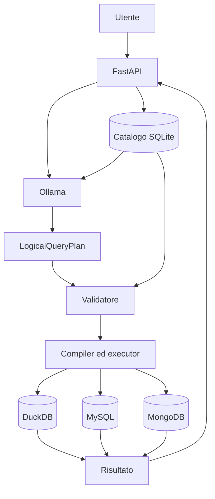

# QueryX

QueryX è un agente AI per data engineering che trasforma domande in linguaggio naturale in interrogazioni controllate su sorgenti dati eterogenee.

Supporta:

- file CSV e Parquet tramite DuckDB;
- database relazionali MySQL;
- database documentali MongoDB;
- modelli linguistici locali tramite Ollama.

L'LLM classifica la richiesta e propone un `LogicalQueryPlan`, ma non genera direttamente SQL o pipeline MongoDB eseguibili. Il piano viene validato rispetto al catalogo, compilato deterministicamente ed eseguito soltanto se rispetta i vincoli del sistema.

## Architettura



Il modello linguistico non accede direttamente ai database. Credenziali, nomi fisici, SQL e pipeline restano dettagli interni all'applicazione.

## Requisiti

- Git;
- Docker;
- Docker Compose;
- Ollama;
- almeno un modello installato localmente.

## Avvio rapido

```bash
git clone https://github.com/pyxidious/queryX.git
cd queryX
cp .env.example .env
docker compose up --build -d
```

Verifica dell'applicazione:

```bash
curl http://localhost:8000/health
```

Interfacce principali:

- Home UI: `http://localhost:8000/ui`
- UI query: `http://localhost:8000/ui/query`
- API OpenAPI: `http://localhost:8000/docs`

## Configurazione di Ollama

Avvia Ollama sull'host:

```bash
ollama serve
```

Scarica il modello configurato in `.env`:

```bash
ollama pull qwen3.5:9b
```

Il nome deve corrispondere a `OLLAMA_MODEL`. Con Docker, QueryX raggiunge Ollama tramite `host.docker.internal`.

## Dati dimostrativi

Con lo stack avviato:

```bash
docker compose exec queryx python -m queryx.tools.seed_demo
```

Il seed deterministico genera:

| Backend | Dati | Totale |
|---|---|---:|
| MySQL | customers | 10.000 |
| MySQL | orders | 100.000 |
| MongoDB | profiles | 10.000 |
| MongoDB | events | 100.000 |

Dopo il seed, aggiorna il catalogo:

```bash
curl -X POST http://localhost:8000/sources/mysql/scan
curl -X POST http://localhost:8000/sources/mongodb/scan
```

## Prima interrogazione

```bash
curl -X POST http://localhost:8000/query/natural-language \
  -H 'Content-Type: application/json' \
  -d '{
    "question": "Quanti ordini ci sono per stato?",
    "execute": true
  }'
```

## Importazione di CSV e Parquet

```bash
curl -X POST http://localhost:8000/ingestions/uploads \
  -F 'file=@./orders.csv' \
  -F 'logical_name=orders'
```

Flusso:

```text
upload
→ staging
→ inspection
→ registrazione nel catalogo
→ normalizzazione Parquet
→ vista DuckDB
```

Non sono supportati ZIP, URL remoti, download automatici o upload multipli.

## Riproduzione completa

Il comando seguente verifica Ollama, avvia i servizi, attende l'API, genera i dati, aggiorna il catalogo, rigenera la ground truth ed esegue il benchmark:

```bash
make reproduce
```

Per specificare l'etichetta del run:

```bash
MODEL_LABEL=qwen3.5-9b-100k make reproduce
```

Passaggi separati:

```bash
make up
make wait
make seed
make scan
make ground-truth
make benchmark
make test
```

## Test

Suite completa:

```bash
make test
```

Test specifici per seed e benchmark:

```bash
make test-reproduction
```

## API principali

| Metodo | Endpoint | Funzione |
|---|---|---|
| `GET` | `/health` | stato dell'applicazione |
| `GET` | `/sources` | elenco delle sorgenti |
| `POST` | `/sources/{source_id}/scan` | discovery e profiling |
| `GET` | `/catalog/current` | catalogo corrente |
| `POST` | `/ingestions/uploads` | upload CSV o Parquet |
| `POST` | `/query/validate` | validazione del piano |
| `POST` | `/query/execute` | esecuzione del piano |
| `POST` | `/query/natural-language` | interrogazione in linguaggio naturale |

## Documentazione

- [Benchmark](benchmark/README.md)
- [Test](tests/README.md)
- [Architettura](docs/architecture.md)
- [API](docs/api.md)
- [Configurazione](docs/configuration.md)
- [Ingestion](docs/ingestion.md)

## Limiti attuali

- MySQL e MongoDB supportano piani single-source;
- le query federate tra backend non sono supportate;
- i join devono essere dichiarati nel catalogo;
- non è presente memoria conversazionale multi-turno;
- GraphDB non è ancora supportato.
