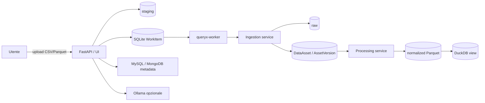

# QueryX

QueryX è un modular monolith Python/FastAPI per trasformare domande in linguaggio naturale in interrogazioni controllate su repository dati, validare i risultati e produrre risposte spiegate. La discovery tecnica è deterministica; Ollama è opzionale e viene usato soltanto per l’arricchimento semantico.

## Funzionalità disponibili

- registry e discovery per MySQL e MongoDB;
- catalogo tecnico SQLite con snapshot, fingerprint e schema drift;
- enrichment semantico opzionale, persistito separatamente;
- importazione manuale di un singolo file CSV o Parquet;
- staging sicuro, inspection limitata, SHA-256 e job persistenti;
- `DataAsset`, `AssetVersion`, storage binding e lineage;
- normalizzazione canonica Parquet tramite PyArrow;
- viste persistenti DuckDB e preview limitate;
- coda SQLite con claim atomico, lease, heartbeat, retry e cancellazione;
- API FastAPI e UI Jinja offline con CSRF e autoescape.

QueryX non comunica direttamente con Kaggle e non effettua download, ricerca dataset, URL fetching o estrazione ZIP. Un dataset può essere stato scaricato manualmente da Kaggle o da qualunque altra fonte: l’utente deve estrarlo localmente e caricare uno dei file CSV o Parquet.

## Architettura

API e worker usano la stessa immagine e gli stessi service applicativi, ma sono processi distinti. SQLite ospita catalogo e coda; non è richiesto un broker esterno.



Il flusso ufficiale dei dataset gestiti è:

```text
download ed estrazione eseguiti dall’utente
→ upload manuale CSV/Parquet
→ staging
→ IngestionJob
→ raw
→ DataAsset/AssetVersion
→ normalizzazione Parquet
→ DuckDB
```

Ogni file produce un `IngestionJob` indipendente. Non sono supportati ZIP, upload multipli, URL o provider esterni.

## Importazione manuale

Apri `http://localhost:8000/ui/ingestions/new`, scegli un file CSV o Parquet e, facoltativamente, un nome logico o un asset esistente. Se la sorgente distribuisce un archivio, estrailo prima sul computer:

```bash
unzip dataset.zip -d dataset
```

Poi carica un singolo `.csv` o `.parquet`. Il filename ricevuto viene validato ma non viene mai usato come path; QueryX genera nomi fisici interni.

Esempio minimo:

```bash
curl -X POST http://localhost:8000/ingestions/uploads \
  -F 'file=@./orders.csv' \
  -F 'logical_name=orders'
```

Per aggiungere una versione a un asset esistente:

```bash
curl -X POST http://localhost:8000/ingestions/uploads \
  -F 'file=@./orders-v2.parquet' \
  -F 'logical_name=orders' \
  -F 'asset_id=<asset-id>'
```

## Provenienza dichiarata

L’upload accetta metadata opzionali strutturati:

| Campo multipart | Limite | Significato |
|---|---:|---|
| `source_provider` | enum | `manual` (default), `kaggle`, `other` |
| `source_reference` | 512 | riferimento descrittivo o slug |
| `source_version` | 128 | versione dichiarata |
| `dataset_title` | 256 | titolo dichiarato |
| `license_name` | 128 | licenza dichiarata |
| `provenance_notes` | 1000 | note descrittive |

Gli spazi vengono normalizzati e l’HTML viene rifiutato. `source_reference` non è un path né un URL operativo: non viene aperto, risolto o reso automaticamente cliccabile. QueryX non verifica e non certifica la licenza. I campi liberi non vengono inviati automaticamente a Ollama e non devono essere inseriti nei log applicativi.

Esempio di dataset scaricato ed estratto manualmente da Kaggle:

```bash
curl -X POST http://localhost:8000/ingestions/uploads \
  -F 'file=@./olist_orders_dataset.csv' \
  -F 'logical_name=orders' \
  -F 'source_provider=kaggle' \
  -F 'source_reference=olistbr/brazilian-ecommerce' \
  -F 'source_version=latest-downloaded-manually' \
  -F 'dataset_title=Brazilian E-Commerce Public Dataset by Olist' \
  -F 'license_name=CC BY-NC-SA 4.0'
```

La provenance è metadata descrittivo dell’origine dichiarata. I metadata tecnici derivano invece dall’inspection deterministica del file. La provenance:

- è persistita sull’`IngestionJob` e nel metadata JSON del lineage;
- è esposta sul job e sull’`AssetVersion`;
- non entra nel content fingerprint, schema fingerprint o recipe fingerprint;
- non modifica inspection, `observed_schema`, `canonical_schema` o `serving_schema`;
- non causa nuove versioni: un contenuto idempotente può riusare la stessa versione;
- genera un nuovo edge soltanto quando la dichiarazione è realmente diversa.

## API principali

- `GET /health`
- `GET /worker/status`
- `GET /sources`
- `POST /sources/{source_id}/scan`
- `GET /catalog/current`
- `POST /ingestions/uploads`
- `GET /ingestions/{job_id}`
- `GET /ingestions/{job_id}/preview`
- `POST /ingestions/{job_id}/cancel`
- `GET /assets`
- `GET /assets/{asset_id}`
- `GET /assets/{asset_id}/versions/{version_id}`
- `POST /assets/{asset_id}/versions/{version_id}/prepare`

I campi JSON preesistenti restano invariati; `provenance` è additivo nelle risposte di job e versione.

## Ingestion e processing

CSV richiede UTF-8 e intestazioni. L’inferenza usa un campione limitato; il conteggio può essere stimato. Parquet usa footer e schema nativi. Le preview vengono lette on demand dai binding controllati e non espongono path fisici.

L’ingestion termina in `ready`, quando raw, asset e versione sono validi. Il processing è separato: applica `canonical-parquet-v1`, scrive un Parquet normalizzato, registra una vista DuckDB e valida schema e output. `observed_schema`, `canonical_schema` e `serving_schema` rimangono distinti.

Idempotenza:

- stesso contenuto, recipe e asset target: riuso della versione pronta;
- contenuto o recipe differenti sullo stesso asset: nuova versione;
- stesso contenuto su asset diversi: asset separati e warning di duplicazione;
- stessa provenance sul riuso: nessun lineage equivalente duplicato;
- provenance diversa sul riuso: edge descrittivo aggiuntivo.

## Worker

Il worker gestisce esclusivamente ingestion e processing. Il claim usa `BEGIN IMMEDIATE`; lease, heartbeat, backoff, retry limitati, cancellazione cooperativa e reconciliation restano separati dallo stato del dominio.

```bash
python -m queryx.app.worker
```

In modalità `worker`, l’API accoda e restituisce `202`; in modalità `inline`, utile per sviluppo e test, esegue nello stesso processo.

## Avvio

Requisiti: Docker con Compose oppure Python 3.12.

```bash
cp .env.example .env
docker compose up --build
```

Compose definisce `queryx`, `queryx-worker`, `mysql` e `mongodb`. API e worker condividono l’immagine e il volume `/app/data`. Non servono credenziali o secret per fonti di dataset.

Avvio locale:

```bash
python -m venv .venv
source .venv/bin/activate
pip install -e '.[dev]'
uvicorn queryx.app.main:app --reload
```

## Configurazione essenziale

La configurazione è documentata in `.env.example`. Le aree principali sono:

- MySQL e MongoDB (`MYSQL_*`, `MONGODB_*`);
- storage (`CATALOG_DB_PATH`, `DATA_RAW_DIR`, `DATA_STAGING_DIR`, `DATA_NORMALIZED_DIR`);
- ingestion e processing (`INGESTION_*`, `PARQUET_*`, `DUCKDB_*`);
- worker (`QUERYX_EXECUTION_MODE`, `WORKER_*`);
- UI (`QUERYX_UI_*`);
- enrichment semantico (`OLLAMA_*`, `QUERYX_ENRICHMENT_*`).

## Compatibilità SQLite legacy

L’inizializzazione applica soltanto modifiche additive e idempotenti. Cataloghi creati da versioni precedenti possono contenere le tabelle legacy `acquisition_runs`, `acquisition_files`, relativi indici o colonne. Il codice corrente non li legge, non li scrive, non li mostra e non tenta di eliminarli.

Queste tabelle possono essere eliminate soltanto ricreando volontariamente il catalogo. L’aggiornamento non cancella asset, job, binding, lineage, raw o normalized esistenti.

## Sicurezza e limiti correnti

- soli CSV e Parquet, un file per richiesta;
- limite upload configurabile, default 25 MiB;
- nessun ZIP o estrazione server-side;
- nessun download, URL fetching o richiesta browser esterna;
- niente autenticazione/autorizzazione applicativa integrata;
- CSRF HMAC double-submit per POST UI, autoescape Jinja e asset locali;
- SQLite e worker singolo sono adatti allo stadio corrente, non a un cluster distribuito;
- la licenza è una dichiarazione dell’utente, non una valutazione legale;
- GraphDB non è ancora supportato.

## Test e verifiche

La suite è offline:

```bash
pytest -q
python -m compileall -q queryx tests
docker compose config --quiet
git diff --check
```

## Roadmap

1. logical query plan;
2. interpretazione delle domande tramite Ollama;
3. generazione controllata di query;
4. validazione dei risultati;
5. risposta finale spiegata;
6. benchmark tra modelli;
7. test di robustezza, consistenza e incertezza;
8. eventuale supporto GraphDB.
