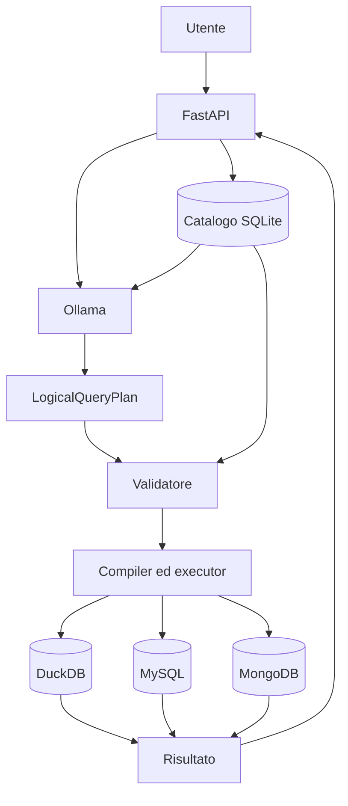

# QueryX

QueryX è un agente AI per data engineering che trasforma domande in linguaggio naturale in interrogazioni controllate su sorgenti dati eterogenee.

Supporta:

- file CSV e Parquet tramite DuckDB;
- database relazionali MySQL;
- database documentali MongoDB;
- modelli linguistici locali tramite Ollama.

L'LLM classifica la richiesta e propone un `LogicalQueryPlan`, ma non genera direttamente SQL o pipeline MongoDB eseguibili. Il piano viene validato rispetto al catalogo, compilato deterministicamente ed eseguito soltanto se rispetta i vincoli del sistema.

## Architettura



Il modello linguistico non accede direttamente ai database. Credenziali, nomi fisici, SQL e pipeline restano dettagli interni all'applicazione.

## Requisiti

Percorso consigliato:

- Git;
- Docker;
- Docker Compose;
- Ollama;
- almeno un modello installato localmente.

## Avvio rapido

```bash
git clone https://github.com/pyxidious/queryX.git
cd queryX
cp .env.example .env
docker compose up --build -d
```

Verifica dell'applicazione:

```bash
curl http://localhost:8000/health
```

Interfacce principali:

- UI query: `http://localhost:8000/ui/query`
- API OpenAPI: `http://localhost:8000/docs`

## Configurazione di Ollama

Avvia Ollama sull'host:

```bash
ollama serve
```

Scarica il modello configurato nel file `.env`, ad esempio:

```bash
ollama pull qwen3.5:9b
```

Il nome del modello deve corrispondere alla configurazione `OLLAMA_*` presente in `.env`.

## Dati dimostrativi

Con lo stack avviato:

```bash
docker compose exec queryx python -m queryx.tools.seed_demo
```

Il seed deterministico genera:

| Backend | Dati | Totale |
|---|---|---:|
| MySQL | customers | 10.000 |
| MySQL | orders | 100.000 |
| MongoDB | profiles | 10.000 |
| MongoDB | events | 100.000 |

Lo script può essere rilanciato senza creare duplicati.

## Prima interrogazione

```bash
curl -X POST http://localhost:8000/query/natural-language   -H 'Content-Type: application/json'   -d '{
    "question": "Quanti ordini ci sono per stato?",
    "execute": true
  }'
```

La risposta contiene classificazione, piano normalizzato, risultato e tempi di esecuzione.

## Importazione di CSV e Parquet

QueryX accetta un singolo file CSV o Parquet per richiesta:

```bash
curl -X POST http://localhost:8000/ingestions/uploads   -F 'file=@./orders.csv'   -F 'logical_name=orders'
```

Flusso:

```text
upload
→ staging
→ inspection
→ registrazione nel catalogo
→ normalizzazione Parquet
→ vista DuckDB
```

Non sono supportati ZIP, URL remoti, download automatici o upload multipli.

## Riproduzione completa

Il percorso più semplice è:

```bash
make reproduce
```

Sono disponibili anche i passaggi separati:

```bash
make up
make seed
make ground-truth
make benchmark
make test
```

Per assegnare un'etichetta al benchmark:

```bash
MODEL_LABEL=qwen3.5-9b-100k make benchmark
```

La documentazione dettagliata del benchmark sarà disponibile in `benchmark/README.md`.

## Test

```bash
make test
```

In alternativa:

```bash
docker compose exec queryx pytest -q
```

La documentazione dettagliata della suite sarà disponibile in `tests/README.md`.

## Avvio locale per sviluppo

```bash
python -m venv .venv
source .venv/bin/activate
pip install -e '.[dev]'
uvicorn queryx.app.main:app --reload
```

In un secondo terminale:

```bash
python -m queryx.app.worker
```

Questa modalità richiede MySQL, MongoDB e Ollama già raggiungibili agli indirizzi configurati in `.env`.

## Interfacce principali:

- Home UI: `http://localhost:8000/ui`
- UI query: `http://localhost:8000/ui/query`
- API OpenAPI: `http://localhost:8000/docs`

## API principali

| Metodo | Endpoint | Funzione |
|---|---|---|
| `GET` | `/health` | stato dell'applicazione |
| `GET` | `/sources` | elenco delle sorgenti |
| `POST` | `/sources/{source_id}/scan` | discovery e profiling |
| `GET` | `/catalog/current` | catalogo corrente |
| `POST` | `/ingestions/uploads` | upload CSV o Parquet |
| `POST` | `/query/validate` | validazione del piano |
| `POST` | `/query/execute` | esecuzione del piano |
| `POST` | `/query/natural-language` | interrogazione in linguaggio naturale |

### Avvio di discovery e profiling di una sorgente

Sostituire `<source_id>` con l'identificativo restituito da `GET /sources`.

```bash
curl -X POST http://localhost:8000/sources/<source_id>/scan
```

### Lettura del catalogo corrente

```bash
curl http://localhost:8000/catalog/current
```

### Upload di un file CSV

```bash
curl -X POST http://localhost:8000/ingestions/uploads \
  -F 'file=@./orders.csv' \
  -F 'logical_name=orders'
```

### Upload di un file Parquet

```bash
curl -X POST http://localhost:8000/ingestions/uploads \
  -F 'file=@./orders.parquet' \
  -F 'logical_name=orders'
```

### Validazione di un piano logico

Salvare il piano in un file chiamato `plan.json`.

```bash
curl -X POST http://localhost:8000/query/validate \
  -H 'Content-Type: application/json' \
  -d @plan.json
```

### Esecuzione di un piano logico

```bash
curl -X POST http://localhost:8000/query/execute \
  -H 'Content-Type: application/json' \
  -d @plan.json
```

### Generazione del piano da linguaggio naturale

Con `execute` impostato a `false`, QueryX genera e valida il piano senza eseguirlo.

```bash
curl -X POST http://localhost:8000/query/natural-language \
  -H 'Content-Type: application/json' \
  -d '{
    "question": "Quanti ordini ci sono per stato?",
    "execute": false
  }'
```

### Generazione ed esecuzione da linguaggio naturale

```bash
curl -X POST http://localhost:8000/query/natural-language \
  -H 'Content-Type: application/json' \
  -d '{
    "question": "Qual è il totale medio degli ordini per stato?",
    "execute": true
  }'
```

### Esempio con filtro numerico

```bash
curl -X POST http://localhost:8000/query/natural-language \
  -H 'Content-Type: application/json' \
  -d '{
    "question": "Quanti ordini hanno un totale maggiore o uguale a 100?",
    "execute": true
  }'
```

### Esempio MongoDB con array annidato

```bash
curl -X POST http://localhost:8000/query/natural-language \
  -H 'Content-Type: application/json' \
  -d '{
    "question": "Quanti eventi contengono almeno un articolo con quantità maggiore o uguale a 2?",
    "execute": true
  }'
```

### Formattazione della risposta con `jq`

```bash
curl -sS \
  -X POST http://localhost:8000/query/natural-language \
  -H 'Content-Type: application/json' \
  -d '{
    "question": "Quanti ordini ci sono per stato?",
    "execute": true
  }' | jq
```

### Visualizzazione dei soli campi principali

```bash
curl -sS \
  -X POST http://localhost:8000/query/natural-language \
  -H 'Content-Type: application/json' \
  -d '{
    "question": "Quanti ordini ci sono per stato?",
    "execute": true
  }' |
jq '{
  classification: .classification,
  normalized_plan: .normalized_plan,
  result: .result,
  answer: .answer
}'
```

## Limiti attuali

- MySQL e MongoDB supportano piani single-source;
- le query federate tra backend non sono supportate;
- i join devono essere dichiarati nel catalogo;
- non è presente memoria conversazionale multi-turno;
- GraphDB non è ancora supportato.

## Struttura della documentazione

```text
README.md
benchmark/README.md
tests/README.md
docs/
```

Il README principale descrive avvio e riproduzione generale. Benchmark, test e dettagli tecnici sono documentati separatamente.
