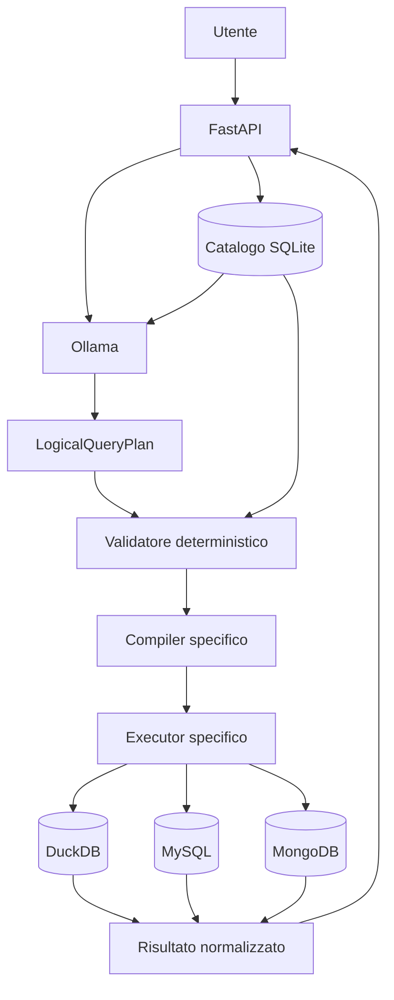

# Architettura di QueryX

QueryX separa la comprensione probabilistica della richiesta dalle fasi deterministiche di controllo ed esecuzione.

## Flusso principale

## Componenti

### FastAPI

Espone API REST e interfaccia web, riceve la richiesta e coordina la pipeline.

### Ollama

Esegue localmente il modello linguistico utilizzato per:

- classificazione della richiesta;
- generazione del piano logico;
- spiegazione opzionale del risultato.

L'LLM non accede direttamente ai database e non genera istruzioni fisiche eseguite senza controllo.

### Catalogo SQLite

Contiene:

- asset disponibili;
- backend associato;
- campi e tipi;
- relazioni dichiarate;
- binding fisici;
- snapshot e versioni.

Il catalogo guida il planning e costituisce la fonte autorevole per la validazione.

### LogicalQueryPlan

È la rappresentazione intermedia indipendente dal backend. Può includere:

- `sources`;
- `joins`;
- `projections`;
- `filters`;
- `aggregations`;
- `group_by`;
- `order_by`;
- `limit`;
- `unwinds`;
- `array_matches`.

### Validatore

Verifica che il piano utilizzi solo asset, campi, operatori e relazioni ammessi.

Un piano non valido viene rifiutato prima della compilazione.

### Compiler ed executor

Il compiler traduce il piano in:

- SQL per DuckDB;
- SQL parametrizzato per MySQL;
- pipeline controllata per MongoDB.

L'executor gestisce la connessione al backend, applica limiti e timeout e restituisce un risultato uniforme.

## Separazione delle responsabilità

| Componente | Responsabilità |
|---|---|
| LLM | interpretazione e proposta del piano |
| Catalogo | descrizione autorevole delle sorgenti |
| Validatore | controllo strutturale e semantico |
| Compiler | traduzione deterministica |
| Executor | accesso al backend |
| FastAPI | orchestrazione e risposta |

## Limiti architetturali attuali

- MySQL e MongoDB supportano piani single-source;
- le query federate tra backend differenti non sono supportate;
- i join devono essere dichiarati nel catalogo;
- non è presente memoria conversazionale multi-turno.
